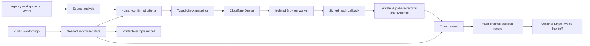

# Greenlit

**The agency says it is done. The client asks for proof. Greenlit connects the SOW promise, observed browser result, client decision, and invoicing handoff.**

The memorable case is intentionally simple: a contact form displays “Request sent” while its API returns HTTP 500. A screenshot looks successful. Greenlit preserves the contradiction, makes the failed promise visible, and reruns the same frozen criterion after the build is fixed.

## Try the complete walkthrough

[Open the public 3-minute walkthrough](https://greenlitproof.vercel.app/workspace?demo=guided)

No account or prior session is required. The walkthrough uses synthetic source material and deterministic sample outcomes, so it remains reliable and creates no customer, evidence, approval, or transaction record.

1. Review six measurable criteria tied to exact SOW quotes.
2. Run `launch-rc1` and inspect AC-04: the interface reports success, but `POST /api/fixture/leads` returns HTTP 500.
3. Verify `launch-rc2` against the same frozen criteria.
4. Open the sample client review, approve the milestone, and view the printable invoice-ready sample record.

For the deployed product boundary, see [What runs live](https://greenlitproof.vercel.app/trust).

## What is live, configured, and planned

| Capability | Status | Boundary |
| --- | --- | --- |
| Public product walkthrough | **Live now** | Runs on Vercel without an account. Uses seeded outcomes and synthetic data. Creates no retained customer record. |
| Source-to-criteria experience | **Live now in the walkthrough** | Exact source quotes, editable criteria, validation, and human confirmation run in the public interface. |
| Typed checks, false-success reveal, and fixed rerun | **Live now in the walkthrough** | The UI and decision flow run live. The public result data is deterministic rather than produced by a retained browser job. |
| Gemini source analysis | **Configured path** | The account-based import uses Gemini structured output when credentials and service capacity are available, with a local source-grounded fallback. |
| Retained browser verification | **Configured path** | Requires an agency account, verified HTTPS staging origin, typed mappings, Cloudflare Queue and Browser capacity, and Supabase. |
| Private evidence and transaction records | **Configured path** | Supabase migrations, row-level security, private storage, retention, and hash-chained transaction events are implemented. The public sample does not create these records. |
| Stripe invoice handoff | **Optional configured path** | Requires an agency-owned Stripe connection. Client approval never charges a card or bank account. |
| General availability, SLAs, certifications, universal site support, and custom integrations | **Planned or not promised** | No production guarantee is claimed until the capability is deployed, tested, and disclosed. |

## Architecture



The public walkthrough and retained project path share the same product screens but have different trust boundaries. The public path is deterministic and local to the browser. The retained path requires authenticated, authorized, configured infrastructure.

### Trust boundaries

- Vercel serves the Next.js application and API routes.
- Gemini receives only the submitted source text in the disclosed account-based analysis path.
- Cloudflare Queue and Browser execute signed, typed verification jobs against an agency-verified public HTTPS origin.
- Supabase provides authentication, row-level protected records, and private evidence storage.
- Stripe is an optional agency-authorized invoicing destination. Greenlit stores no card or bank details.
- Shared Zod contracts validate messages at service boundaries.

See [docs/ARCHITECTURE.md](docs/ARCHITECTURE.md) for request flows, storage boundaries, and threat controls.

## Typed-check runner

Greenlit does not ask a model to generate or execute arbitrary JavaScript. Each automated criterion must map to one of five allowlisted check families:

1. **Element state:** confirm that an approved accessible element is visible, enabled, or present in the expected count.
2. **Link destination:** confirm that a visible link resolves to the expected same-origin destination.
3. **Form submission:** perform an authorized bounded form interaction and evaluate the visible and network outcome together.
4. **Viewport layout:** inspect the approved mobile or desktop viewport for horizontal overflow.
5. **Accessibility scan:** run the bounded Axe scan, optionally after an authorized staging interaction exposes validation output.

Unsupported or subjective promises remain explicitly client-reviewed. Custom retained runs also require a verified staging origin and a typed mapping for every automated promise.

## Hash-chain design

The retained project path separates evidence integrity from decision history:

- Each browser run produces an evidence manifest containing the frozen criteria revision, identified build, expected and observed results, timestamps, runner metadata, and artifact hashes.
- The manifest is hashed with SHA-256 before it is attached to a review packet.
- Client decisions and transaction events are appended with the previous event hash, producing a tamper-evident chain.
- Approval records preserve the review snapshot and chain head used at decision time.
- The public walkthrough deliberately does not generate evidence hashes or retained audit events. Its final page is labeled as a sample record.

This design makes later alteration detectable. It is not a notarization, legal signature, payment guarantee, or accounting ledger.

## Repository map

```text
apps/web/                 Next.js product, public walkthrough, API routes, and tests
packages/contracts/       Shared Zod contracts and typed runner messages
workers/runner/           Cloudflare Queue and Browser verification worker
supabase/migrations/      Database, row-level security, storage, and retention schema
e2e/                      Desktop and mobile Playwright coverage
docs/                     Architecture, operations, video, and submission material
```

## Local setup

```bash
pnpm install
cp .env.example .env.local
pnpm dev
```

Open `http://localhost:3000/workspace?demo=guided` for the public sample flow. The Gemini key is only needed for `POST /api/analyze`; the guided walkthrough does not require it. Use synthetic, redacted, or explicitly non-confidential source material only.

## Validation

```bash
pnpm typecheck
pnpm test
pnpm lint
pnpm build
pnpm exec playwright test
```

## Deployment

- **Web and API:** import the repository into Vercel with the repository root as the project root. `vercel.json` contains the monorepo build settings.
- **Database and storage:** create a Supabase project and apply all migrations in `supabase/migrations/` in filename order. Configure Supabase Auth Site URL and redirect URLs for `/auth/callback`.
- **Runner:** retain or create the queue named in `workers/runner/wrangler.toml`, set `RUNNER_HMAC_SECRET`, then run `pnpm runner:deploy`.
- **Scheduled recovery:** set the same distinct `CRON_SECRET` on the web app and runner. Cloudflare Cron Triggers run daily retention and hourly invoice and outbox recovery.
- **AI:** set `GEMINI_API_KEY` and optionally `GEMINI_MODEL` in Vercel. Calls have a bounded deadline and fall back to a local source-grounded draft when Gemini is unavailable.
- **Stripe invoicing, optional:** configure the Stripe App, test-mode secret, webhook secret, and token-encryption key. Keep `STRIPE_ALLOW_LIVE_MODE=false` for beta testing.
- **Closed beta:** set `BETA_ALLOWED_EMAILS`, `ADMIN_EMAILS`, `NEXT_PUBLIC_OPERATOR_NAME`, and `NEXT_PUBLIC_SUPPORT_EMAIL`. Daily global limits are configurable without enabling paid services.
- **Notifications:** every client decision appears in the product. An optional disclosed webhook can provide immediate external delivery, with failed attempts retained in a bounded retry outbox.

## Submission and operating material

- [Timed product video script](docs/JUDGE_DEMO.md)
- [Architecture and trust boundaries](docs/ARCHITECTURE.md)
- [Submission copy](docs/DEVPOST_SUBMISSION.md)
- [Technical review notes](docs/JUDGING_NOTES.md)
- [Complete submission package](docs/hackathon/README.md)
- [Beta operations](docs/BETA_OPERATIONS.md)
- [Incident response](docs/INCIDENT_RESPONSE.md)
- [Legal readiness](docs/LEGAL_READINESS.md)

## Data policy

The free-tier build is for synthetic, redacted, or explicitly non-confidential material only. Uploaded documents are extracted in memory and are not persisted by the analysis route; Google may still process eligible unpaid-tier Gemini inputs under its terms. Screenshot evidence defaults to 90 days, approval and audit records to four years, and review links to 72 hours, extendable within a 14-day hard limit. Legal holds can suspend deletion. Greenlit can create an invoice in an agency’s connected Stripe account, but it is not a legal e-signature, payment guarantee, accounting ledger, or accessibility certification.
