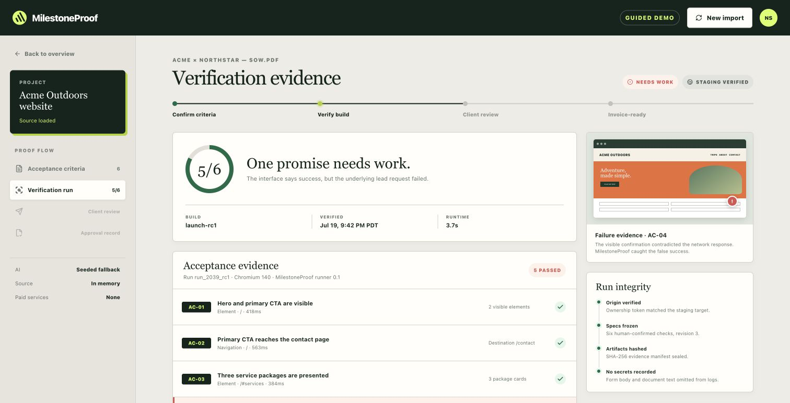
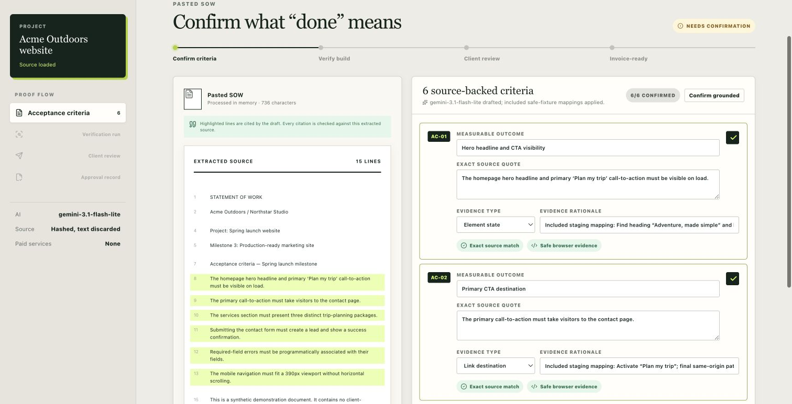
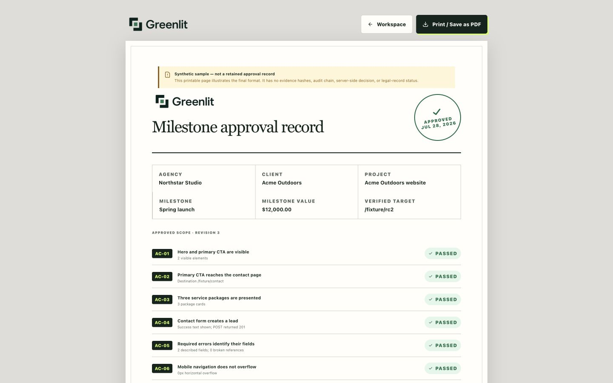
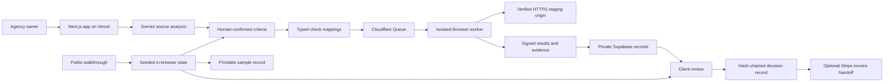

# Greenlit

> Greenlit helps web agencies turn statement-of-work promises into human-confirmed criteria, browser evidence, client approval, and an invoice-ready record.

[Live product](https://greenlitproof.vercel.app) | [3-minute walkthrough](https://greenlitproof.vercel.app/workspace?demo=guided) | [What runs live](https://greenlitproof.vercel.app/trust) | [Technical deck](docs/hackathon/greenlit-blueprint-hackathon-deck.pdf) | [Run locally](#quick-start)

> **Evaluation note:** The public walkthrough needs no account, invite, API key, or prior session. It uses synthetic source material and seeded outcomes, runs through the complete interface, and creates no customer, evidence, approval, or transaction record.



## Why this matters

Web agencies often finish a milestone before they can invoice it. The delay is not always the work itself; it is the gap between a contract promise, a staging build, technical QA, and a client decision. Screenshots can look convincing while hiding a failed request, and raw test output is rarely written for a client. Greenlit makes the signed promise the center of acceptance, so the agency can show what was expected, what actually happened, and what the client approved.

## What Greenlit does

Greenlit connects one business workflow from scope to sign-off:

1. An agency pastes a non-confidential SOW excerpt or uploads a selectable-text PDF, TXT, or Markdown file.
2. Gemini proposes measurable acceptance criteria with an exact supporting quote for each one.
3. Greenlit independently grounds those quotes against the source. A human reviews and confirms every criterion before it can be frozen.
4. Supported promises map to allowlisted browser checks. Subjective or unsupported promises remain explicitly client-reviewed.
5. A verification run records the expected and observed result for each frozen promise.
6. The client sees the promise and evidence together, then approves the milestone or requests changes.
7. Approval creates an invoice-ready proof record and can hand off to a separately configured Stripe invoicing path.

The included sample has one memorable failure: the contact page displays `"Request sent"` while `POST /api/fixture/leads` returns HTTP 500. Greenlit marks the promise as failed, then reruns the same frozen criterion after the build is fixed.

| Human-controlled criteria | Invoice-ready sample record |
| --- | --- |
|  |  |

## What makes it different

- **Contract-first, not test-first:** every result stays attached to the exact SOW language the agency confirmed.
- **Observed behavior, not screenshot theater:** form checks compare the visible result with the underlying network outcome, which catches false success states.
- **AI drafts, humans decide:** Gemini can propose structure, but it cannot freeze criteria, generate executable scripts, or approve a milestone.
- **The same scope proves the fix:** a failed build and corrected build use the same frozen criteria, so the requirement cannot move after a failure.
- **Client-readable evidence:** the final review translates browser observations into the promises the client already understands.
- **Honest evaluation path:** the public walkthrough is visibly labeled as seeded and never presents its sample output as retained customer evidence.

## Built with

| Layer | Technology | Why it matters |
| --- | --- | --- |
| Product and API | TypeScript, React 19, Next.js 16 | One responsive application for the agency workspace, client review, records, and API routes |
| AI analysis | Gemini API and Google GenAI SDK | Structured extraction of criteria, exact quotes, evidence families, and rationales |
| Contracts | Zod 4 | Shared validation across the web service and browser runner |
| Browser verification | Cloudflare Queue, Workers, Browser Rendering, Playwright, Axe | Isolated, queued execution of typed checks against an authorized staging origin |
| Data and authentication | Supabase Postgres, Auth, private Storage, row-level security | Owner-scoped records, private evidence, expiring review access, and retention controls |
| Billing handoff | Stripe | Optional invoice creation in the agency's own connected Stripe account |
| Hosting | Vercel | Production delivery of the Next.js application and API |
| Quality gate | Vitest, Playwright, ESLint, TypeScript, GitHub Actions | Unit, state-machine, desktop, mobile, cross-browser, build, audit, and release checks |

### Why these platforms matter

Gemini is constrained to a source-grounded drafting role. Cloudflare separates browser execution from the web application and passes only a job identifier through the queue. Supabase keeps agency records and evidence private, while Vercel exposes a stable public evaluation path. Stripe remains an optional downstream handoff; approval never charges a payment method.

## How to test the project

### Fastest path

1. Open the [public walkthrough](https://greenlitproof.vercel.app/workspace?demo=guided).
2. Confirm the six source-backed sample criteria.
3. Run `launch-rc1`.
4. Inspect AC-04 and compare the visible success message with the HTTP 500 result.
5. Verify `launch-rc2` against the same frozen criteria.
6. Create the sample client review, approve the milestone, and open the printable sample record.

Expected result: the first build shows `5/6` with AC-04 needing work; the fixed build shows `6/6`; the final record remains clearly labeled as a synthetic, non-retained sample.

### Evaluation fallbacks

1. **Primary:** [deployed walkthrough](https://greenlitproof.vercel.app/workspace?demo=guided)
2. **Secondary:** [technical presentation](docs/hackathon/greenlit-blueprint-hackathon-deck.pdf)
3. **Local:** run the same seeded path with no external credentials
4. **Deep review:** inspect [architecture](docs/ARCHITECTURE.md), [technical review notes](docs/JUDGING_NOTES.md), and the [timed video script](docs/JUDGE_DEMO.md)

No public video URL is claimed until the final recording is uploaded and accessible without special permissions.

## Quick start

### Prerequisites

- Node.js 20.9 or newer
- pnpm 11.9.0, as pinned in `package.json`
- A modern browser
- Docker only if you want the optional local Supabase stack

### Run the public sample locally

```bash
git clone https://github.com/anayagarwalla-ai/greenlit.git
cd greenlit
corepack enable
pnpm install --frozen-lockfile
pnpm dev
```

Open:

- Product: `http://localhost:3000`
- Guided walkthrough: `http://localhost:3000/workspace?demo=guided`
- Sample client review: `http://localhost:3000/review/demo`
- Sample approval record: `http://localhost:3000/receipt/demo`

The guided walkthrough requires no environment variables, database, Gemini key, or browser runner.

<details>
<summary><strong>Configure the retained project path</strong></summary>

Copy the example environment file into the Next.js application:

```bash
cp .env.example apps/web/.env.local
```

The main configuration groups are:

| Capability | Variables | Required for guided demo |
| --- | --- | --- |
| Gemini import | `GEMINI_API_KEY`, `GEMINI_MODEL`, service-tier flags | No |
| Supabase records | `NEXT_PUBLIC_SUPABASE_URL`, `NEXT_PUBLIC_SUPABASE_ANON_KEY`, `SUPABASE_SERVICE_ROLE_KEY` | No |
| Browser runner | `RUNNER_URL`, `RUNNER_HMAC_SECRET`, `RECORD_HASH_SECRET`, `GREENLIT_ORIGIN_TOKEN` | No |
| Scheduled maintenance | `CRON_SECRET` | No |
| Closed beta | `BETA_ALLOWED_EMAILS`, `ADMIN_EMAILS`, capacity settings | No |
| Stripe invoicing | Stripe App, test key, encryption key, and webhook variables | No |
| Public notices | operator, support, security, location, and notification-provider variables | No |

Never commit real secrets. Keep `STRIPE_ALLOW_LIVE_MODE=false` during testing.

For a local Supabase project:

```bash
pnpm dlx supabase start
pnpm dlx supabase db reset
```

`supabase db reset` applies every migration in `supabase/migrations/` and loads `supabase/seed.sql`. The retained path also needs a configured Cloudflare runner and an authorized public HTTPS staging origin.

</details>

## Architecture



The public walkthrough and retained project path share the same product screens but have different trust boundaries. The sample path is deterministic and local to the browser. The retained path requires authentication, configured services, a verified staging origin, and available runner capacity.

## Technical details

### Typed verification

Greenlit never asks a model to generate or execute arbitrary JavaScript. Confirmed automated promises map to five check families:

1. Element state
2. Same-origin link destination
3. Authorized form submission
4. Viewport layout
5. Bounded Axe accessibility scan

Checks use accessible element references and typed assertions. They reject credentials, arbitrary headers, CSS or XPath selectors, off-origin navigation, and private network targets.

### Important API actions

| Action | Purpose |
| --- | --- |
| `POST /api/analyze` | Produce a structured, source-grounded criteria draft |
| `POST /api/verify-origin` | Bind an authenticated agency to a controlled staging hostname |
| `POST /api/runs` | Validate a frozen mapping and queue retained verification |
| `GET /api/runs/[runId]` | Read the owner-authorized run state |
| `POST /api/reviews` | Freeze a passing run into a client review snapshot |
| `POST /api/reviews/[packetId]/decision` | Record one authorized client decision |
| `GET /api/reviews/[packetId]/export` | Export the review and decision record |

### Data integrity and privacy

- Evidence manifests contain the frozen revision, identified build, expected and observed results, timestamps, runner metadata, and artifact hashes.
- SHA-256 manifest hashes bind retained evidence to a review packet.
- Client and transaction events include the previous event hash, creating an append-only, tamper-evident chain.
- Review tokens are exchanged for short-lived HttpOnly sessions and cleared from the address bar.
- Screenshot evidence defaults to 90-day retention; approval and audit records default to four years; legal holds can suspend deletion.
- Original uploaded documents are processed for analysis and are not persisted by the analysis route.
- The walkthrough uses synthetic, non-confidential data and creates no server-side record.

See [Architecture and trust boundaries](docs/ARCHITECTURE.md), [Legal readiness](docs/LEGAL_READINESS.md), and [Incident response](docs/INCIDENT_RESPONSE.md) for the deeper implementation notes.

### Testing and supported environments

```bash
pnpm typecheck
pnpm lint
pnpm test
pnpm build
pnpm test:e2e
```

The release workflow also tests every database migration against Postgres 17, runs a production-build smoke test, audits production dependencies, preserves a same-commit release manifest, and exercises Chromium, Firefox, WebKit, desktop, and mobile paths. The interface includes semantic labels, visible focus states, keyboard-tested dialogs, responsive checks down to 320px, and typed Axe scans. Greenlit does not claim accessibility certification.

## AI usage

The default model is `gemini-3.1-flash-lite`. Gemini receives the submitted source text and returns structured JSON containing an atomic criterion, exact source quote, proposed check family, support flag, and rationale.

Safeguards:

- Every quote is independently matched against normalized source text.
- Ungrounded criteria cannot be frozen.
- Editing a confirmed criterion clears its confirmation.
- A human confirms the source quote, wording, evidence family, and rationale.
- Zod validates the structured response.
- Unsupported or subjective promises stay client-reviewed.
- The model cannot generate runner code or approve a milestone.
- Calls use a bounded deadline and have a local source-grounded fallback.
- The interface discloses the active Gemini service tier and limits unpaid-tier use to synthetic or explicitly non-confidential material.

AI accelerates drafting; it is not the authority on scope, observed behavior, or client acceptance.

## What is real today

| Capability | Status | Boundary |
| --- | --- | --- |
| Public end-to-end walkthrough | **Live** | Deployed, no account, seeded outcomes, no retained record |
| Criteria review, failure reveal, fixed rerun, review, and printable sample | **Live** | Real interface behavior with deterministic sample state |
| Gemini, queued browser execution, Supabase records, and Stripe handoff | **Configured path** | Implemented integrations that require credentials, account access, authorization, and capacity |
| General availability, universal site compatibility, paid capacity, SLAs, certifications, and custom integrations | **Not promised** | Outside the current demonstrated scope |

## Limitations and non-goals

- The public walkthrough is not retained browser evidence and does not produce a legal record.
- Custom verification supports authorized public HTTPS staging origins, not arbitrary private, authenticated, or third-party sites.
- Cross-origin scripts, fonts, images, and navigation are blocked in retained verification.
- The product is not a notarization service, general-purpose e-signature platform, payment guarantee, accounting ledger, security audit, or accessibility certification.
- Gemini output can be incomplete or wrong; human confirmation remains mandatory.
- Stripe is an optional invoicing handoff. Approval never charges a card or bank account.
- Broad production guarantees remain outside the current beta scope.

## Challenges and lessons learned

- **AI without authority:** exact-quote grounding and confirmation gates mattered more than a polished model response.
- **A memorable but honest failure:** paired fixtures made the hidden HTTP 500 visible without presenting synthetic output as customer proof.
- **Safe verification:** a job-only queue, HMAC leases and callbacks, typed checks, origin proof, and same-origin restrictions kept the runner bounded.
- **Client communication:** technical evidence became useful only after it was translated back into the promise the client signed.

## Future work

- Team roles and collaboration beyond the current single-owner account
- Framework adapters that import evidence from existing Playwright or Cypress suites without importing arbitrary execution
- Change-order detection when a new SOW revision alters frozen criteria
- Agency metrics for approval time, review rounds, and milestone value waiting for approval
- Project-management and invoicing integrations that preserve the boundary between approval, signature, invoice, and payment

## Project and acknowledgements

Maintained by [anayagarwalla-ai](https://github.com/anayagarwalla-ai). Built for the Blueprint Hackathon with Google Gemini, Vercel, Cloudflare, Supabase, Stripe, and the open-source packages listed in the workspace manifests.

Submission material:

- [Devpost-ready project copy](docs/DEVPOST_SUBMISSION.md)
- [Timed product video script](docs/JUDGE_DEMO.md)
- [Technical presentation](docs/hackathon/greenlit-blueprint-hackathon-deck.pdf)
- [Technical review notes](docs/JUDGING_NOTES.md)

## License, security, and support

No open-source license has been added; all rights remain with the repository owner.

- Product boundaries and providers: [Trust center](https://greenlitproof.vercel.app/trust)
- Privacy: [Privacy notice](https://greenlitproof.vercel.app/privacy)
- Security or product concern: [Contact Greenlit](https://greenlitproof.vercel.app/contact)
- Repository incident process: [docs/INCIDENT_RESPONSE.md](docs/INCIDENT_RESPONSE.md)
