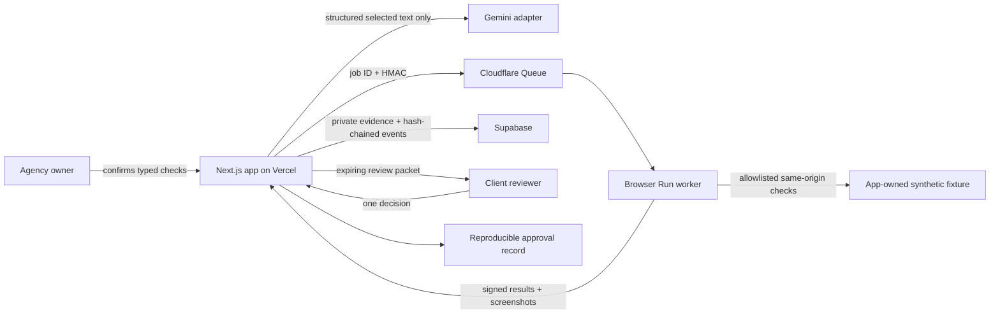

# Architecture and trust boundaries

## Key boundaries

- AI can draft a criterion and propose one of five typed check families. It cannot emit JavaScript, CSS/XPath selectors, credentials, headers, off-origin URLs, or arbitrary actions.
- A check is not executable until the owner confirms it and the shared Zod contract accepts it.
- The submission runner executes only the app-owned synthetic fixture. Arbitrary imported SOWs stop at an honest configuration handoff and cannot inherit fixture evidence.
- The web service dispatches only a job ID. The worker leases a frozen revision using timestamped HMAC requests and posts back typed results.
- Form mutation is limited to the exact confirmed same-origin endpoint and is not automatically retried after submission begins.
- Owner reruns, run status, and review creation require a separate HttpOnly owner session; knowing a record UUID is not authorization.
- Review links put the bearer token in the URL fragment. The hosted flow exchanges it for a short-lived HttpOnly reviewer session and clears it from the address bar.
- Review and receipt APIs are `no-store` and `noindex`; the reviewer explicitly affirms authority, intent, and electronic-record consent.
- Transaction events are append-only and SHA-256 hash-chained. Screenshot evidence defaults to 90 days; approval/audit records default to four years; an authenticated daily retention job respects legal holds.

## Status model

`READY → VERIFYING → NEEDS_WORK | READY_FOR_REVIEW → IN_REVIEW → CHANGES_REQUESTED | APPROVED`

The current submission creates revision 1 from the confirmed criteria. The failing and fixed fixture builds reuse that same durable record; only a completed all-pass run can create a client review packet.
