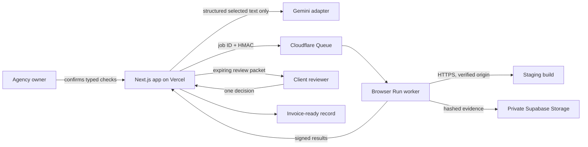

# Architecture and trust boundaries

## Key boundaries

- AI can draft a criterion and propose one of five typed check families. It cannot emit JavaScript, CSS/XPath selectors, credentials, headers, off-origin URLs, or arbitrary actions.
- A check is not executable until the owner confirms it and the shared Zod contract accepts it.
- Custom staging origins require an exact ownership token at `/.well-known/milestoneproof.txt`; DNS is checked before verification and private/reserved destinations are rejected.
- The web service dispatches only a job ID. The worker leases a frozen revision using timestamped HMAC requests and posts back typed results.
- Form mutation is limited to the exact confirmed same-origin endpoint and is not automatically retried after submission begins.
- Review links put the bearer token in the URL fragment. The intended hosted flow redeems it once, clears it from the address bar, and uses a short-lived HttpOnly session.
- Review and receipt pages are `no-store`, `noindex`, frame-blocked, and excluded from analytics.

## Status model

`DRAFT → ANALYZING → NEEDS_CONFIRMATION → READY → VERIFYING → NEEDS_WORK | READY_FOR_REVIEW → IN_REVIEW → CHANGES_REQUESTED | APPROVED → RECEIPT_READY`

Changing the SOW, amount, origin, or check configuration increments the milestone revision and invalidates previous runs and review packets. A new build on the same verified origin can reuse the frozen checks.

