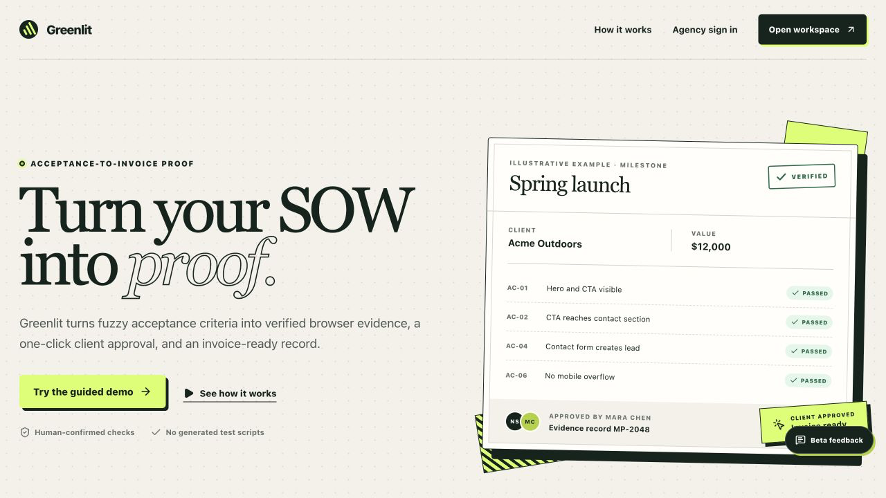
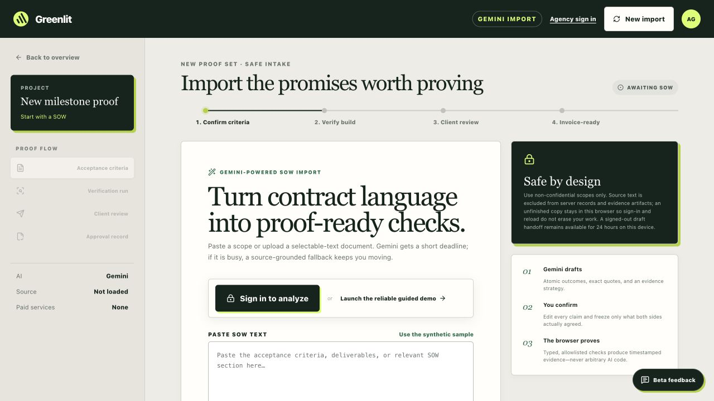
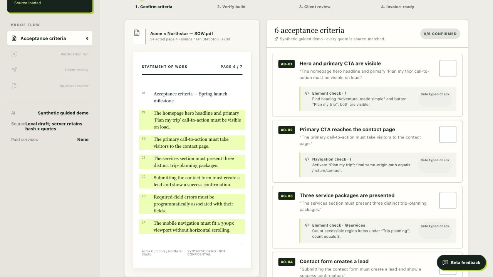
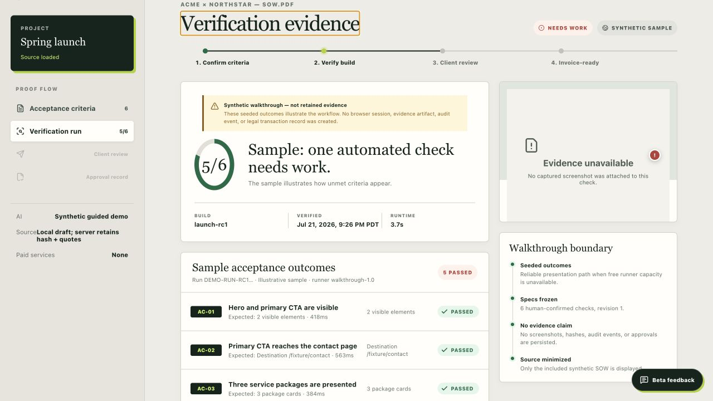
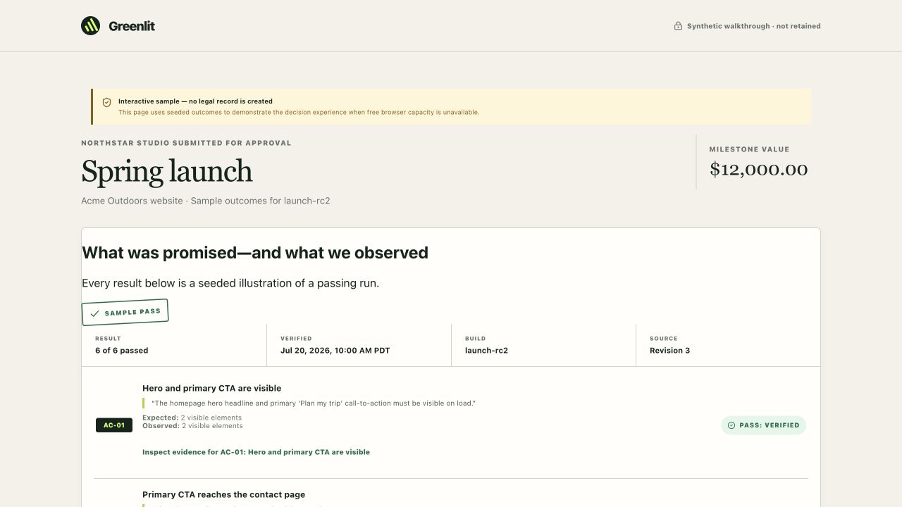
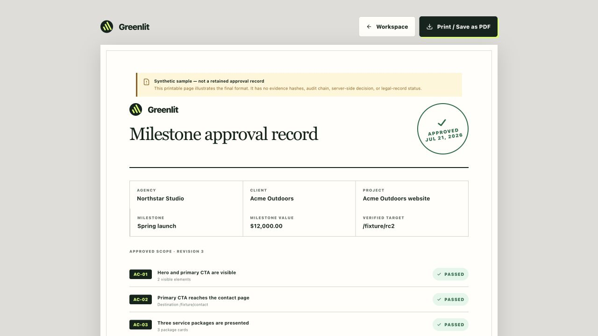
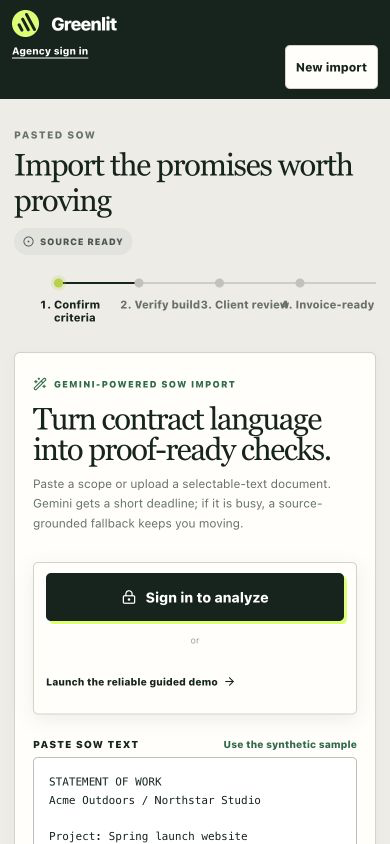
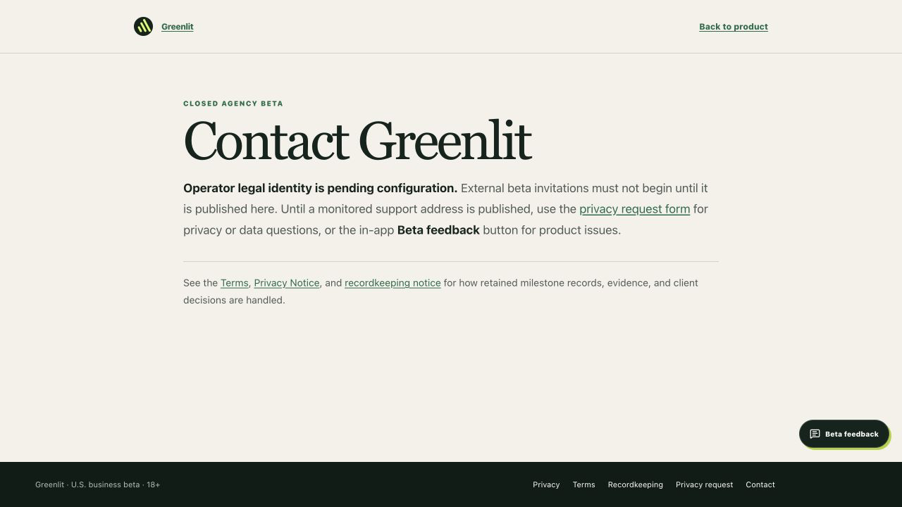

# Greenlit beta-readiness audit

Date: July 21, 2026
Production target: https://greenlitproof.vercel.app
Scope: product behavior and in-product configuration only; no source, production record, Gemini, runner, or Stripe mutation was performed.

## Verdict

Greenlit is polished enough for a controlled demo, but it is not ready for external agency beta invitations yet. The public experience, guided walkthrough, client-review presentation, evidence display, and printable approval record are strong. The remaining work is concentrated in transaction correctness, runner concurrency, draft privacy/recovery, Stripe truthfulness and failure handling, production-flow verification, and a small set of visible mobile/accessibility defects.

## Journey health

1. **Landing and public entry — Mostly healthy.** The landing page is responsive at 320px and 390px, preserves the visual identity, exposes Agency sign in on mobile, and has working legal links. The `Try the guided demo` CTA opens ordinary intake rather than starting the demo.
2. **Sign-in and draft handoff — Needs fixes.** Drafts survive navigation and sign-in handoff, but anonymous draft data can remain in browser storage after the promised 24-hour window. Silent autosave failures and sign-out ordering can also lose work.
3. **SOW intake and Gemini import — Mostly healthy, not production-proven.** Real imports start blank, business fields validate, file and paste paths are present, and the criteria step stays locked until generation. A real paid/unpaid Gemini transaction, file parsing, malformed response, and provider failure have not been exercised in deployed production.
4. **Criteria confirmation and mapping — Mostly healthy.** Criteria can be added, removed, duplicated, reordered, edited, and grounded to exact quotes. Confirmation controls are visually weak, and the server does not guarantee that every automated criterion is represented in the frozen check list.
5. **Verification runner — Not beta-ready.** Submitted check/result/artifact arrays are internally validated, but omitted automated criteria can still disappear from the check manifest. A running attempt can be leased again without a unique lease claim, which makes duplicate or concurrent execution possible.
6. **Client review, changes, and receipt — Mostly healthy.** The guided flow correctly shows failure, rerun, evidence boundaries, source quotes, approval/request-changes dialogs, and exact cents. The retained production path still needs a complete separate-browser transaction, and receipts do not expose every downstream invoice/amendment state.
7. **Stripe invoicing — Not beta-ready.** Test mode is presented as if it emails invoices, out-of-order webhooks can regress status, several failure/retry paths are incomplete, and the send confirmation/modal need safety and accessibility work.
8. **Operator, legal, and support surfaces — Blocked by configuration.** The live Contact, Privacy, and Terms pages explicitly state that external beta invitations must not begin until the adult operator identity, monitored support/privacy address, governing law, and venue are published.

## Must fix before inviting external testers

1. Enforce one check for every frozen automated criterion before a run can queue or become reviewable. Missing checks/results/evidence must be shown as missing—not converted into manual review.
2. Give every runner lease a unique claim ID and reject concurrent or replayed leases, completions, and failures.
3. Expire and purge the actual anonymous SOW draft after 24 hours, not only its sign-in claim marker; warn users on shared devices.
4. Make Stripe status transitions monotonic or reconcile each webhook with Stripe so a late `open` event cannot overwrite `paid`.
5. Make test-mode invoice language truthful. Stripe test-mode send requests do not email customers; say that a test invoice was created and expose its hosted test link. Only use “emailed/sent” wording when live mode is intentionally enabled and confirmed.
6. Complete one adult-authorized retained production transaction: invited magic link → real Gemini/file import → verified owned staging origin → real runner and private screenshots → separate client browser → approval and request-changes paths → revised rerun/resend → receipt/JSON/privacy export → Stripe sandbox states.
7. Publish the adult operator/legal identity, monitored support/privacy email, mailing address if required, governing law, and venue in production. The current pages are intentionally self-blocking.
8. Reconcile the production runner limit with the operating policy: health reports eight runs/day while the beta runbook specifies three.

## High-priority product fixes

9. Make invoice-plan writes/deletes and their audit events atomic; close the smaller equivalent gap in review-session redemption.
10. Let agencies retry a failed Stripe send even when a draft invoice row already exists.
11. Replace the vague invoice submission with a true final confirmation showing test/live mode, Stripe account, client, billing email, exact amount/currency, due date, and line item. Use an explicit CTA such as `Send $12,000.50 test invoice`.
12. Make the invoice dialog a complete accessible modal: initial focus, focus trap, Escape, focus restoration, background isolation, and a z-index above feedback.
13. Check `response.ok` when loading Stripe connection and invoice-plan data so auth/network errors do not appear as blank or disconnected state.
14. Return non-2xx on failed Stripe deauthorization persistence so Stripe retries; record connection, disconnection, and deauthorization operational events.
15. Resolve zero-dollar milestones: either require a positive invoiceable value or show a clear no-charge milestone state and hide invoicing.
16. Add visible `Saving`, `Saved`, `Save failed`, and retry states for retained workspace autosave and restore.
17. Clear account drafts only after sign-out succeeds; handle sign-out failures without navigating away or deleting local recovery data.
18. Check and display failures for dashboard actions such as Stripe disconnect and Mark read, with reliable busy-state cleanup.
19. Make invite provisioning reconcilable when the invite ledger succeeds but Supabase Auth user creation fails; return the accurate partial-failure state.
20. Protect concurrent Stripe token refreshes with a lock or compare-and-swap.
21. Require a successful, explicit customer match/preflight before automatic invoice sending, especially when more than one customer shares an email.
22. Add the public record ID, criteria revision, run/evidence manifest hash, and receipt hash to Stripe metadata.
23. Show pending and failed invoice states on signed-in receipts, and remove owner-only Workspace controls from reviewer receipt sessions.
24. Surface append-only privacy corrections/amendments in owner records, receipts, and normal transaction exports.
25. Trim server-submitted names and source quotes before validation so whitespace-only values cannot pass direct API requests.
26. Decide and enforce what happens to old legal records when an invite is removed—blocked completely or retained read-only access—and explain it in the UI/terms.

## Reliability and real-agency compatibility

27. Add a production-target browser suite. The current E2E run starts local Next development and mocks auth, Gemini, runner, review, and Stripe boundaries.
28. Add real browser tests for invitation enforcement and magic-link delivery/redemption, including removed invites, corporate link scanners, and account isolation.
29. Add real Gemini tests for PDF/TXT/Markdown, exact quotes, the 15-second fallback, malformed provider output, and provider failure.
30. Add real runner tests for origin proof, DNS/redirect rebinding, job resume, signed evidence URLs, individual uploads, missing/partial artifacts, and capacity failures.
31. Add retained review tests for simultaneous links, redemption, expiry/revocation, duplicate decisions, request changes, revise/rerun/resend, receipts, and exports.
32. Add Stripe sandbox tests for OAuth, customer selection, manual/automatic invoices, idempotency, out-of-order/duplicate webhooks, failure retry, disconnect/reconnect, and privacy export.
33. Put a hard remaining-time budget around each browser check so one slow action cannot strand the job.
34. Support common protected staging deployments through an explicit safe mechanism such as Basic Auth or deployment-protection tokens, or document the exact supported prerequisite.
35. The runner blocks every cross-origin asset. Because many real sites load CDN fonts, scripts, and images, either support a frozen safe asset-origin allowlist or make this limitation prominent before testers invest time.
36. Add Firefox/WebKit, full keyboard-only, site-wide accessibility, 200% zoom, forced-colors, and multi-page print visual coverage.

## Confirmed polish and accessibility defects

37. Fix the 390px workflow stepper: `Verify build`, `Client review`, and `Invoice-ready` visibly run together.
38. Make the landing `Try the guided demo` CTA start the demo directly instead of opening blank intake.
39. Give criteria confirmations an obvious visible label/check state; the current empty square relies too heavily on its accessible name.
40. Remove the contradictory `aria-invalid="false"` state after native email validation fails, or provide a custom associated error and set it true.
41. Warn when browser storage is unavailable and an unsigned draft cannot be preserved.
42. On verification-status/network failure, explain that the retained job remains active and provide `Return to dashboard` in addition to the synthetic-demo escape hatch.
43. Fix sample-record inconsistencies such as a named demo source becoming `Source: Not named` on the receipt and dates changing across local demo resets.
44. Ensure all paid-service, confidentiality, and invoice claims are driven by deployed configuration. The current site is explicitly unpaid/non-confidential while outreach copy promises automatic invoicing.

## What is already strong and should not be rebuilt

- The landing visual identity and main product story.
- Blank real imports and field-level intake validation.
- Signed-out draft handoff into sign-in.
- Add/remove/duplicate/reorder criteria and exact source-quote grounding.
- Exact integer-cents display.
- Result/evidence count validation for the checks that are in the submitted manifest.
- Private screenshot metadata, hashes, source quotes, and evidence presentation.
- The failure → rerun → review → approval/request-changes guided walkthrough.
- The printable receipt design and transaction JSON boundary.
- Mobile header recovery, feedback modal behavior, and client-decision modal behavior.
- Core atomic run/review/decision transitions and the major origin/DNS protections already present.

## Evidence limitations

The public Greenlit production site, signed-out workspace, complete synthetic walkthrough, client decision dialogs, receipt, legal pages, feedback modal, mobile layouts, and keyboard focus behavior were inspected directly. The current `greenlitproof.vercel.app` domain did not have an authenticated Chrome session; an older authenticated `milestoneproof.vercel.app` tab was deliberately not treated as current-production evidence. No billable Gemini, Cloudflare, Stripe, outbound review, invoice, or retained production mutation was triggered. Authenticated and back-end findings are therefore based on the deployed health signals, repository implementation, migrations, and automated tests, and must be closed with the retained production transaction above.

## Screenshots

