# Greenlit company-demo readiness audit

**Audit date:** July 25, 2026

**Scope:** Product story, public website, synthetic demo journey, mobile behavior, conversion, trust, legal/privacy, security, reliability, accessibility, operations, sales readiness, measurement, and first-pilot readiness.

## Executive decision

Greenlit is a strong, coherent **synthetic design-partner demo**, but it is not yet ready to be presented as a production-ready company beta.

| Motion | Decision | Why |
| --- | --- | --- |
| Customer-discovery interviews without product access | **Go** | The problem, ICP hypothesis, and discovery materials are strong. |
| Founder-led synthetic demo | **Conditional go** | The complete story works, but the public operator/legal blocker, outdated deployment, positioning, and demo package should be fixed before prospects receive the link. |
| Real pilot using a company SOW or retained evidence | **No-go** | Production sign-off, provider terms, email, backups, incident ownership, and a real deployed-system transaction remain unverified. |
| Broad company or enterprise pitch | **No-go** | The current product, legal boundary, workflow, and feature set are specifically suited to a narrow U.S. web-agency design-partner beta. |

The shortest accurate positioning is:

> Greenlit is an early design-partner beta for U.S. web agencies that want to test whether one evidence-backed milestone review can shorten approval limbo. The demo is synthetic; real pilot access is invitation-only and tightly bounded.

## What works now

- The current local product completes the full synthetic journey: SOW criteria → failed verification → fixed verification → client handoff → client review → explicit approval → approval record.
- The currently deployed guided demo also completes that synthetic journey.
- Desktop and mobile layouts had no horizontal overflow in the audited states.
- No application console errors were observed in the manual browser walkthrough.
- The public web and runner health endpoints returned HTTP 200 during the audit.
- Live security headers include a strong CSP, HSTS, frame denial, MIME-sniffing protection, Permissions Policy, COOP/CORP, and a restrictive referrer policy.
- Fresh verification passed:

  - `pnpm test`: **144 tests passed** — web 123, runner 16, contracts 5.
  - `pnpm typecheck`: passed.
  - `pnpm lint`: passed.
  - `pnpm build`: passed; Next.js generated the current 61-route application.

## P0 — complete before actively pitching and sharing the product link

### 1. Remove the public “not ready” blocker

The live product visibly says that external beta invitations must not begin. Trust, Contact, Privacy, and Terms disclose missing operator identity, governing law/venue, and monitored support information.

Required:

- Publish the real operating entity and responsible adult/operator.
- Publish the mailing address, governing law, and venue.
- Configure monitored branded support, privacy, and security addresses.
- Assign incident, privacy, and communications owners.
- Obtain the counsel review required by the project’s own readiness checklist.
- Replace the personal Gmail address in `security.txt` with the monitored branded security address.

Acceptance criterion: no prospect-visible page describes required operator, legal, privacy, or support configuration as pending, and the repository sign-off records the responsible owners.

Evidence: [production sign-off](../../PRODUCTION_SIGNOFF.md), [legal readiness](../../LEGAL_READINESS.md), [incident response](../../INCIDENT_RESPONSE.md), [Contact source](../../../apps/web/app/contact/page.tsx), [Trust source](../../../apps/web/app/trust/page.tsx).

### 2. Freeze, deploy, and verify the exact demo release

The current repository has a polished Resource Center and Trust Center, while production returns 404 for both `/resources` and `/trust`. Production health is also the older shallow response and does not prove the intended web, runner, or database versions.

Required:

- Freeze a release candidate and record its exact commit SHA.
- Reconcile the stale version expectations in `PRODUCTION_SIGNOFF.md` with runner `0.9.0` and schema `202607240002`.
- Pass CI and deploy that exact SHA.
- Verify `/`, guided demo, `/resources`, `/trust`, `/contact`, Privacy, Terms, login, and the public health endpoint on production.
- Run the protected deep check and record the deployed web, runner, and database schema versions.
- Keep the public health endpoint shallow, but do not treat `{ "ok": true }` as beta-readiness evidence.

Acceptance criterion: production matches the reviewed release, all intended public routes return 200, deep health reports the expected versions and `readyForBeta`, and the release SHA is recorded.

### 3. Choose one ICP and one commercial motion

Do not pitch “companies” broadly. Greenlit is currently designed for U.S. web design/development agencies with milestone or fixed-fee billing, public HTTPS staging, one accountable reviewer, and recurring approval delay.

Define:

- Buyer: owner/COO or Head of Delivery.
- Daily users: project/account lead plus developer/QA.
- Reviewer: the client stakeholder authorized to decide.
- First cohort: small agencies with low procurement overhead and no regulated data.
- Geography: U.S. product access only; international agencies may be research interviewees until legal/data terms expand.
- Motion: either customer discovery or a defined design-partner offer. Do not say “not selling” and simultaneously run a sales presentation.

Acceptance criterion: the homepage, outreach script, qualification form, meeting agenda, and follow-up all use the same ICP, geography, promise, and next step.

### 4. Add a real conversion path

The public site currently leads to the guided demo, workspace, sign-in, and resources. It has no “Request a demo” or “Apply for beta” path, and sign-in explicitly says it does not request an invitation.

Required:

- Add a focused `/request-demo` or `/beta-application` path.
- Put the CTA in the header, hero, Resource Center, Trust Center, and synthetic approval record.
- Capture business email, role, agency size, location, monthly milestone volume, current approval process, typical completion-to-approval delay, staging model, and desired next step.
- Route qualified requests to a booking flow or an owned response queue.
- Replace the `[LINK]` placeholder in the existing follow-up template.
- Track source, request completion, qualification, booked meeting, held demo, and next step.

Acceptance criterion: a qualified visitor can move from any high-intent public page to an acknowledged, owned, measurable next step without attempting to sign in.

### 5. Correct the positioning and promise

Required copy changes:

- Replace “one-click client approval.” The real flow requires link redemption, identity entry, and three authority/consent acknowledgements. Use “focused client decision” or “guided client sign-off.”
- Label the primary guided CTA “Synthetic walkthrough” or equivalent.
- Say “for web agencies” above the fold.
- Separate the quick synthetic walkthrough from a real first milestone; do not imply that ownership setup, criteria mapping, verification, client response, and invoice handoff always take ten minutes.
- Do not claim proven ROI, saved time, customers, or approval acceleration until measured evidence exists.

Acceptance criterion: every marketing claim remains true when a prospect watches the entire real interface and reads the trust/legal pages.

### 6. Define the design-partner offer

The pricing worksheet is still blank. A public pricing page is optional, but the founder needs consistent answers before taking calls.

Decide:

- Pilot duration and cohort size.
- Free or paid status.
- Included milestones and verification runs.
- Concierge onboarding and support coverage.
- Required agency effort and feedback commitment.
- Suitable and prohibited data.
- Success criteria and the post-beta decision date.
- Expected future pricing basis.
- Separate permission for any quote, logo, case study, or outcome publication.

A reasonable starting offer is one suitable milestone, 30 days, concierge onboarding, bounded usage, one structured feedback interview, and an explicit end-of-pilot decision.

Acceptance criterion: the offer fits on one page and every founder/operator gives the same answer.

### 7. Package the actual company meeting

Create a 20-minute discovery-led meeting rather than reusing the hackathon video:

1. Three to five minutes: current approval workflow and delay.
2. Six to eight minutes: tailored false-success → corrected evidence → client decision journey.
3. Three minutes: security, privacy, retention, and current limits.
4. Recap the problem in the prospect’s words.
5. Agree on one concrete next step.

Prepare:

- Pre-authenticated clean demo account or a deterministic synthetic fixture.
- Reset checklist and rehearsal checklist.
- A 90–120 second recorded fallback.
- Offline screenshots and a sample approval record.
- A concise deck, one-page PDF, trust brief, pilot one-pager, and recap email.
- A specific response for pricing, integrations, support, data handling, and “what happens if verification is wrong?”

Acceptance criterion: the demo can be delivered cleanly if authentication, network, runner, or email fails, and it ends in a measurable next action.

### 8. Clean the public Resource Center

The current Resource Center is valuable, but it exposes founder/operator work such as an unrecorded video, case-study capture kit, pricing decisions, missing operator/support information, and absent customer claims.

Required:

- Keep customer-facing quick-start, reviewer guide, FAQ, troubleshooting, integration boundaries, and trust material public.
- Move founder-only scripts, capture kits, unfinished commercial decisions, and operating checklists into an authenticated or internal area.
- Finish the narrated video before advertising it.

Acceptance criterion: every public resource helps a prospect evaluate or use Greenlit and none reads like an internal launch punch list.

## P1 — complete before accepting real company data or starting the first pilot

### Production proof and provider controls

- Complete one genuine retained transaction against the deployed system: authentication, SOW analysis, origin proof, isolated runner, client link/email, decision, record, invoice handoff, privacy export/delete, retention, and operator recovery.
- Do not put a confidential prospect SOW into the current unpaid Gemini mode. Confirm paid-provider billing, suitable terms, and the data-processing boundary first.
- Verify custom SMTP, SPF/DKIM/DMARC, corporate link-scanner behavior, reviewer-session redemption, sender identity, allowlists, and bounce/failure handling.
- Verify Stripe sandbox install/OAuth, customer matching, draft invoice, webhook, idempotency, corrections, disconnect, and privacy behavior.
- Verify deployed runner `0.9.0`, secret separation, operator MFA recovery, and Supabase capacity.

### Reliability and operations

- Run all required database suites in CI. CI currently runs SQL suite `01` but the repo marks suite `02` as required; also reconcile CI PostgreSQL 18 with Supabase PostgreSQL 17.
- Add operator-controlled global pauses for runs, review decisions, and invoice actions.
- Enforce storage/capacity admission instead of only reporting capacity in health.
- Schedule encrypted backups, define owners and RPO/RTO, prove offsite storage, and complete a hash-verified isolated restore drill.
- Publish the support window, response expectations, severity escalation, and incident communications path.
- Add centralized error reporting, alerting, and a small public status surface.

### Product resilience

- Add bounded timeouts, abort handling, and retry-safe messages to sign-in, privacy requests, review loading/redemption/decision, receipt loading/unlock, and dashboard mutations.
- Add browser-level regression tests for review link create/extend/revoke, receipt-link creation, notifications, Stripe disconnect, and sign-out.
- Replace native `window.prompt`/`window.confirm` in the receipt-link flow with the product’s custom accessible dialog pattern.
- Add an in-page retry to the admin MFA initial error state.
- Make decision, review, and invoice operations visibly idempotent after a network retry.

### Legal, privacy, and security

- Prepare closed-pilot terms, acceptable-use and authorization language, prohibited-data guidance, retention terms, claims limitations, DPA/subprocessor register, and breach/incident responsibility.
- Decide whether reviewer identity needs stronger verification if records may be used in payment disputes.
- Add dependency auditing, secret scanning, SAST, automated update handling, and an SBOM or equivalent dependency inventory.
- Conduct an external review of origin isolation, reviewer sessions, admin privacy export, Stripe handling, and tenant boundaries.

### Accessibility, cross-browser, and performance

- Raise high-value operational copy from 8–10px toward a projected-demo and low-vision-safe 12–14px where possible.
- Fix the programmatic-heading focus treatment that creates an oversized gold rectangle and can scroll/crop the top of the next state.
- Run Axe plus manual keyboard, screen-reader, 200%/400% zoom, forced-colors, reduced-motion, and print checks.
- Add Firefox and WebKit/Safari coverage; current automated browser coverage is Chromium-only.
- Measure production Lighthouse and Core Web Vitals before making performance claims.
- Ensure copy-success messages are announced through a live region.
- Add explicit safe relationship handling to decision-dialog links that open new tabs.

### Demo polish

- Replace blank “No screenshot in this sample” areas with deterministic synthetic evidence that looks like the real retained artifact, while remaining clearly labeled synthetic.
- Resolve the timezone mismatch between the client review and approval record.
- Replace awkward copy such as “0 manual promises are clearly labeled.”
- Keep consent/authority copy readable in the mobile decision dialog.
- Test projection at common meeting-room resolutions and 125%/150% browser zoom.

## P2 — before scaling or selling into larger organizations

- Tenant roles and permissions, enterprise RBAC, SSO/SAML/SCIM, break-glass recovery, and two-person destructive actions.
- Per-tenant retention, legal holds, data residency, and contract-specific data policies.
- Independently verifiable or signed receipts beyond the current internal hash chain.
- Public status history, defined SLOs, paging, support SLA, and capacity forecasts.
- Protected staging/preview support and controlled external-asset allowlists.
- Stripe live-mode, tax/currency controls, queued maintenance, and operator-console pagination.
- Enterprise security evidence such as a penetration test and, only when the target market requires it, a SOC 2/ISO roadmap.
- Branded domain, production email identity, mature deliverability, and procurement-ready security/legal materials.

## Journey audit

### 1. Landing page — **Healthy flow; positioning and conversion need work**

The first viewport is polished and communicates SOW → verification → approval clearly. It does not name web agencies above the fold, calls the approval “one-click,” and has no demo-request path.

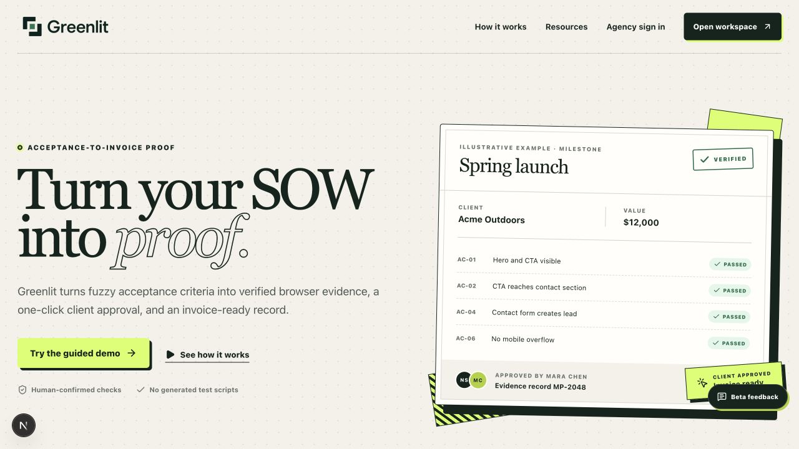

### 2. Guided criteria — **Works; focus and projection polish needed**

The source/criteria comparison and stepper are strong. Programmatic focus creates a conspicuous gold rectangle around the heading, the primary action can fall below the first viewport, and the feedback control crowds the edge.

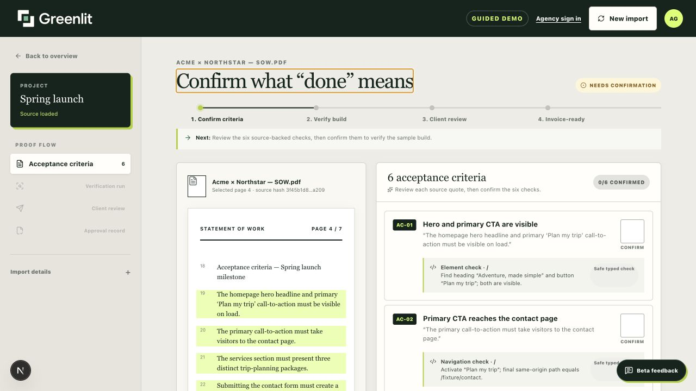

### 3. Failed verification — **Works; proof credibility gap**

The false-success reveal is the best part of the story. The auto-focused heading can crop the top context, and “No screenshot in this sample” weakens the visual proof during a company pitch.

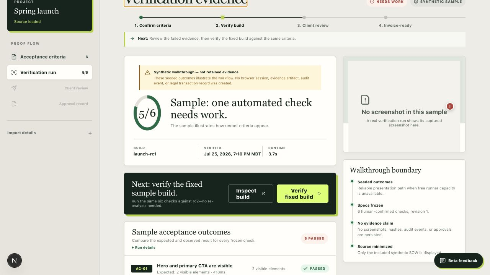

### 4. Passing verification — **Works; synthetic evidence is visually thin**

The fixed state and next action are clear. The blank sample screenshot and repeated disclaimers make the demo feel less like the retained product.

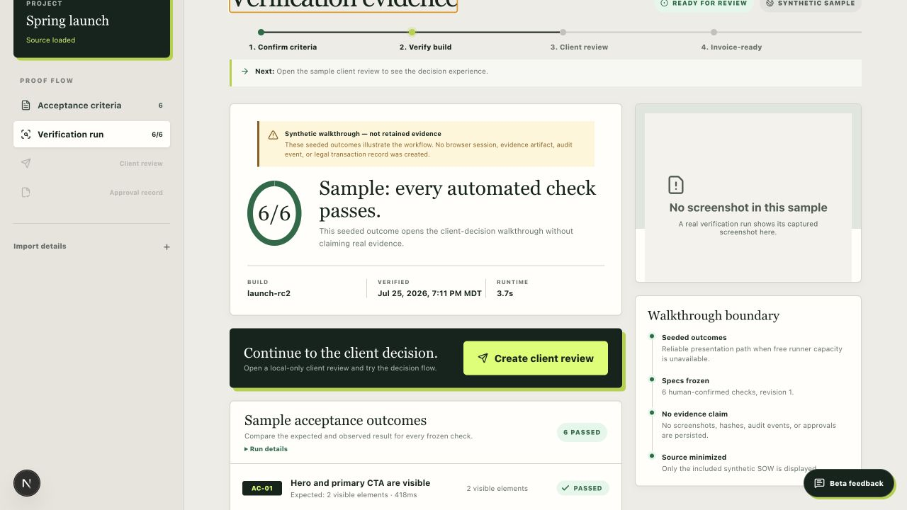

### 5. Client handoff — **Healthy**

The handoff explains what the client receives. Synthetic disclaimers dominate the card, and the “0 manual promises” sentence is awkward.

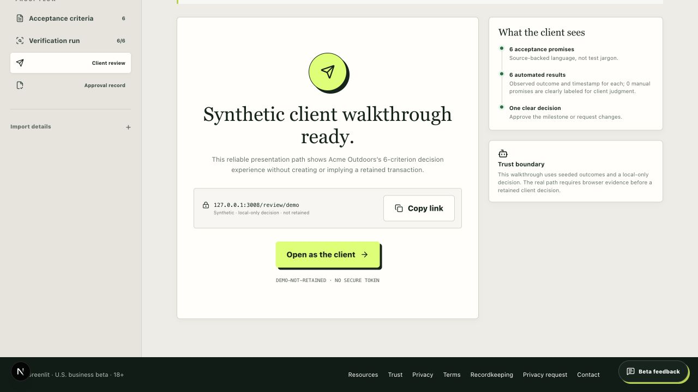

### 6. Client review — **Healthy; timezone and density risk**

The client sees criteria, evidence, and limitations clearly. The displayed timezone differed from the approval record, and the page is long for a projected presentation.

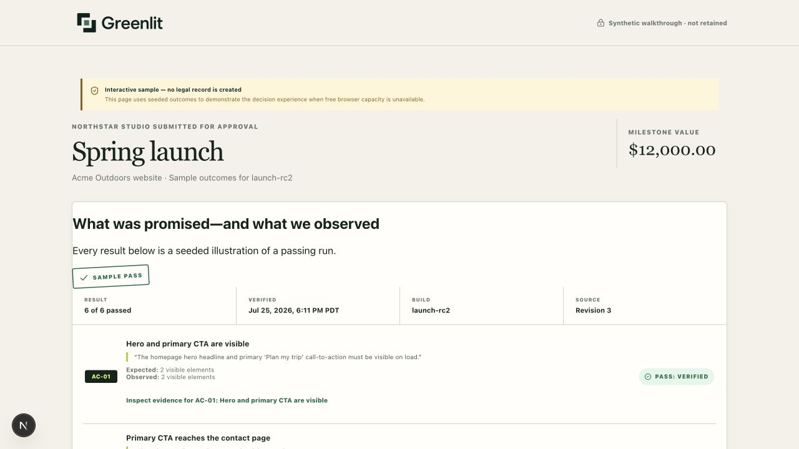

### 7. Approval dialog — **Works; contradicts the headline**

The dialog requires identity and three explicit acknowledgements. That is appropriate for trust, but it directly disproves “one-click approval.” Consent copy is also small.

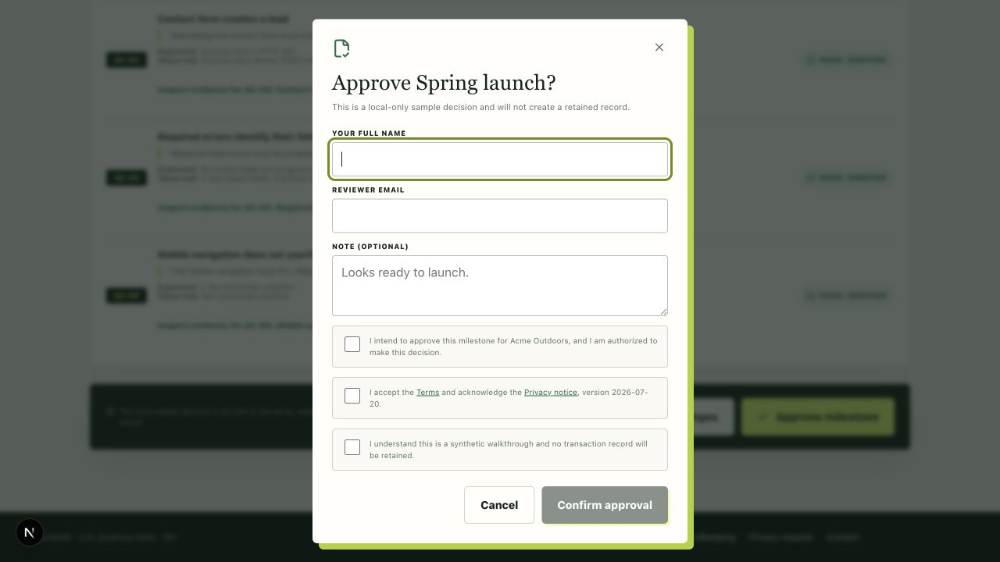

### 8. Approval success — **Works; focus treatment looks unfinished**

The success state is decisive, but the automatically focused heading receives the same oversized gold rectangle.

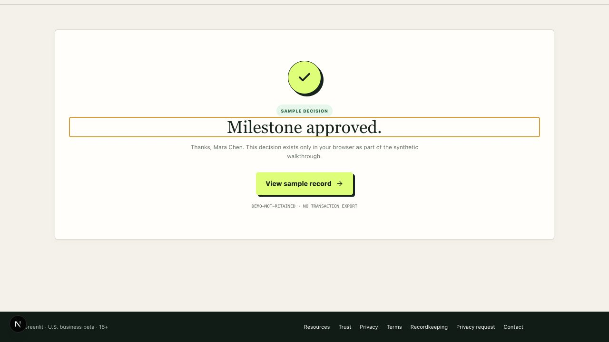

### 9. Approval record — **Strong**

The printable record is one of the most compelling artifacts. It is appropriately labeled as synthetic and not retained, so it should not be presented as customer proof.

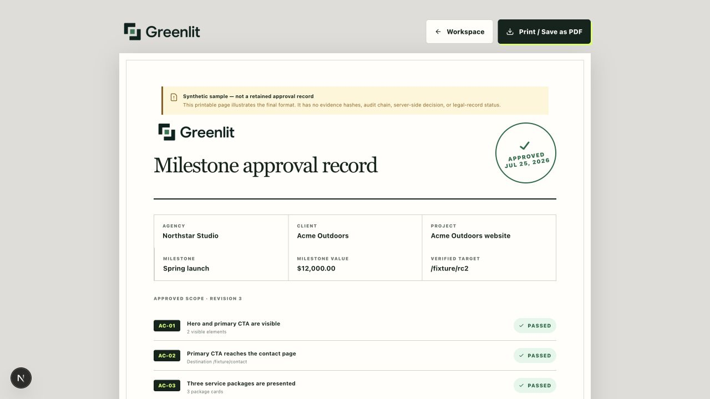

### 10. Resource Center — **Strong locally; unavailable in production**

The current local library is unusually deep and useful. It needs customer/operator separation and deployment.

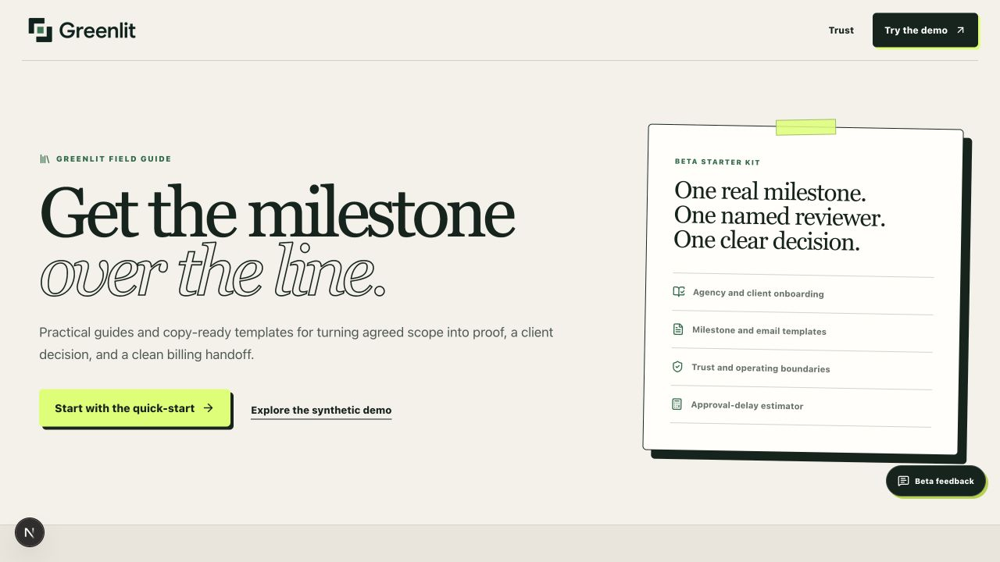

### 11. Trust Center — **Strong locally; unavailable in production**

The trust story is honest and specific. It becomes a liability when prospects reach the visible operator/support blockers.

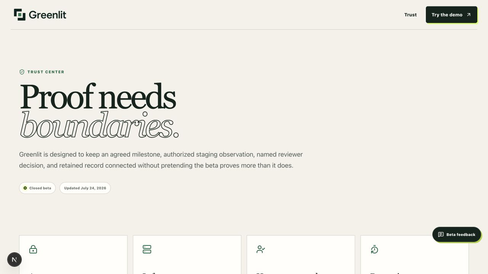

### 12. Trust reporting section — **Blocked**

The page explicitly says operator identity is required and external invitations must not begin.

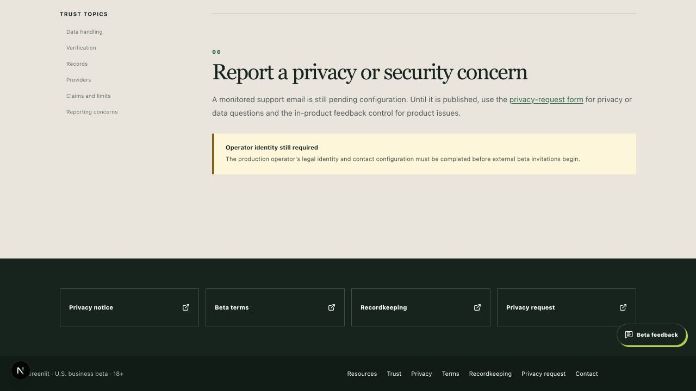

### 13. Local Contact page — **Blocked**

The reviewed release still advertises the missing operator identity and support configuration.

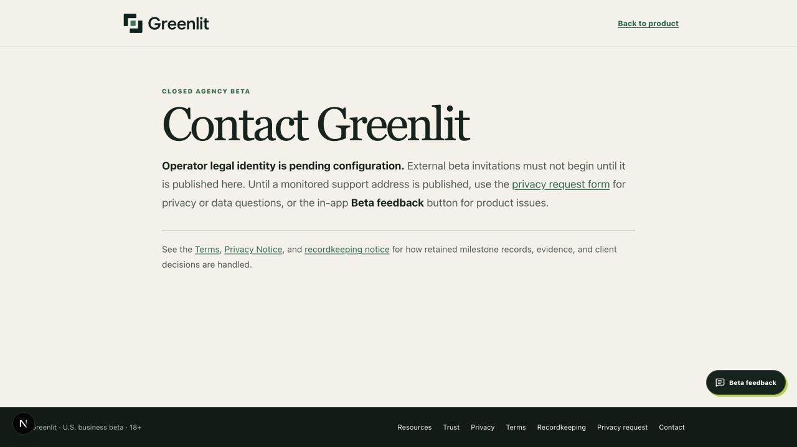

### 14. Live Contact page — **Blocked in production**

The same external-invitation blocker is prospect-visible on the deployed site.

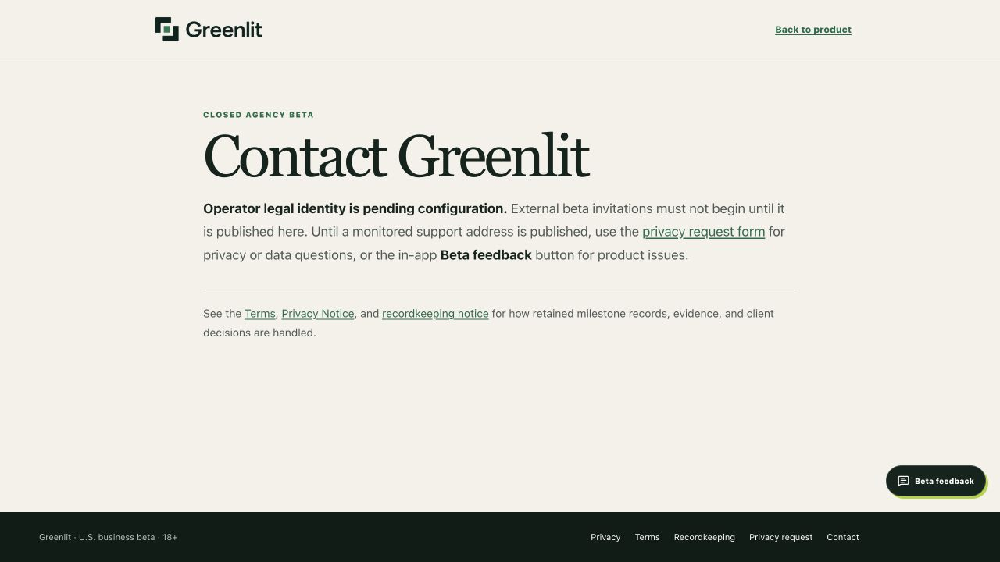

### 15. Live Resource Center — **Broken in production**

`/resources` returns the product 404, confirming the intended demo release is not deployed. `/trust` also returned 404.

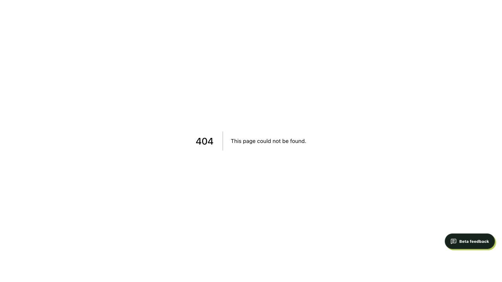

### 16. Mobile landing — **Healthy**

The 390×844 layout is readable with no horizontal overflow. Header actions wrap into a slightly awkward but usable hierarchy.

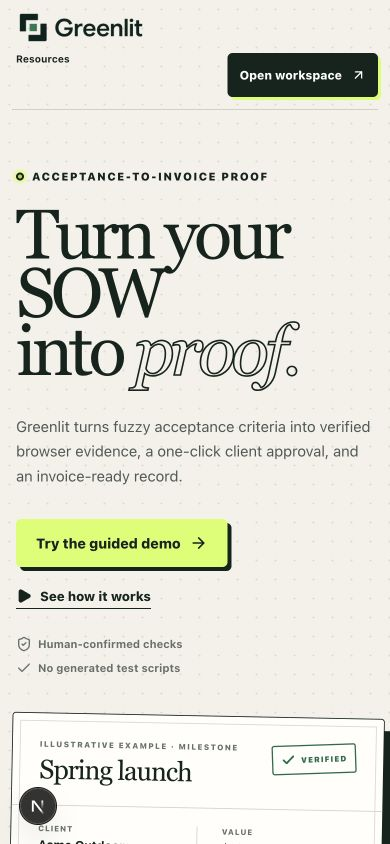

### 17. Mobile approval dialog — **Healthy; readability risk**

The full decision dialog fits without horizontal overflow. Consent copy is small enough to merit an accessibility and real-device check.

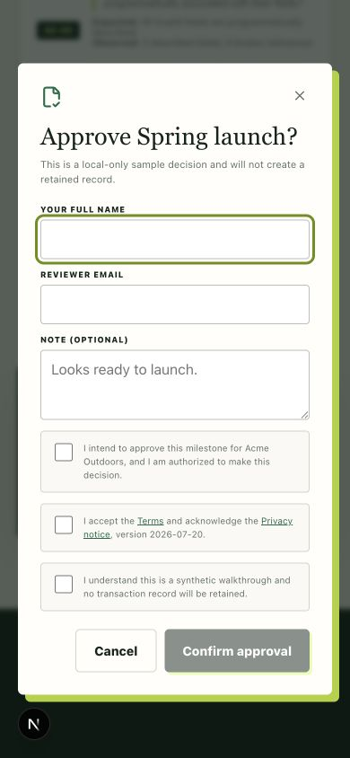

## Sales and proof gaps

- No populated beta-account or success-scorecard rows were found.
- No approved customer logo, quote, case study, retained milestone result, or measured ROI was found.
- The product currently has a design-partner hypothesis, not market proof.
- Minimum credibility milestone after the first discovery cycle:

  - Five qualified interviews.
  - Two agencies completing guided onboarding.
  - One real retained milestone and client decision after production sign-off.
  - One approved quote or a clearly documented non-fit result.

- Do not promise integrations beyond Stripe. PM, messaging, storage, automation, and accounting handoffs are currently manual or roadmap items.
- Target smaller agencies first. Larger firms will commonly require SSO, RBAC, DPA/security review, audit reports, SLAs, and procurement evidence that Greenlit does not yet provide.

## Measurement plan

Recommended North Star:

> Percentage of suitable verified milestones receiving a client decision within the agreed deadline.

Add instrumentation for:

- Landing source and campaign.
- Synthetic demo start and completion.
- Demo/beta request and qualification.
- Invitation, sign-in, criteria confirmation, and ownership verification.
- Run completion, run failure reason, and rerun.
- Review sent, opened, redeemed, decided, and elapsed decision time.
- Invoice-ready state and invoice handoff.
- Next milestone, retained use, or abandonment reason.

Guardrails:

- Median completion-to-decision time.
- Setup and first-proof time.
- Review rounds.
- Value waiting for approval.
- Support minutes per account.
- False-positive and record-integrity failures.
- Willingness to use Greenlit on the next suitable milestone.

## Recommended execution order

### Before outbound link sharing

1. Configure legal/operator/support identity and named owners.
2. Freeze and deploy the current release; verify exact versions and all public routes.
3. Narrow the ICP and choose discovery versus design-partner sales.
4. Add the demo/beta request conversion path.
5. Correct “one-click,” audience, timing, and synthetic-demo language.
6. Decide the offer and pricing answer.
7. Finish the meeting runbook, fallback video, reset procedure, trust brief, and sample artifact.
8. Remove founder-only unfinished material from the public Resource Center.

### Before first real pilot

1. Confirm paid-provider/data terms.
2. Complete a retained deployed-system transaction.
3. Verify email, link scanners, runner, Stripe, privacy, and MFA recovery.
4. Fix CI database coverage and version drift.
5. Add pause controls, capacity admission, alerting, and staffed support.
6. Complete backup scheduling and an isolated restore drill.
7. Close browser, accessibility, timeout, and dashboard-operation gaps.
8. Sign the pilot agreement and data-processing boundary.

## Go/no-go checklist

A founder-led synthetic company demo is ready only when all of these are true:

- [ ] No public page says external invitations must not begin.
- [ ] Production matches a recorded release SHA.
- [ ] `/resources`, `/trust`, Contact, Privacy, Terms, and the full guided journey pass production smoke tests.
- [ ] Deep health proves expected web, runner, and schema versions.
- [ ] The audience is explicitly U.S. web agencies.
- [ ] The primary CTA is clearly labeled synthetic.
- [ ] “One-click approval” and other contradictory claims are removed.
- [ ] A request-demo/beta path has an owner and measurable follow-up.
- [ ] Pilot length, price, usage, support, data limits, and success criteria are decided.
- [ ] The live demo has a clean fixture, reset procedure, recorded fallback, and sample record.
- [ ] The presenter can explain current security, privacy, retention, integrations, and non-claims accurately.
- [ ] The next step after the meeting is explicit.

A real company pilot additionally requires every P1 production, provider, legal, backup, incident, support, accessibility, and retained-transaction gate above.

## Audit limitations

- The audit used synthetic fixtures and did not submit a real or confidential company SOW.
- No production records, emails, Gemini requests, Stripe changes, deployments, privacy mutations, or backup restores were performed.
- Private deep-health and production credentials were not available, so those controls remain unverified rather than proven broken.
- The manual walkthrough covered the in-app Chromium browser on desktop and mobile viewports. It was not a formal WCAG audit and did not cover Firefox, WebKit/Safari, a screen reader, forced-colors, or 400% zoom.
- No legal conclusion is offered; counsel review remains required.
- No production performance baseline, real-user monitoring data, or external penetration test was available.
