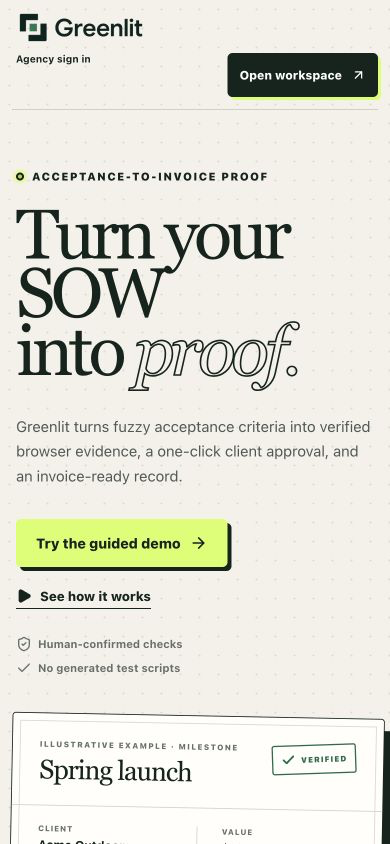
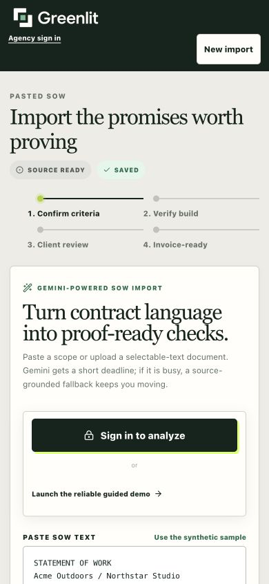
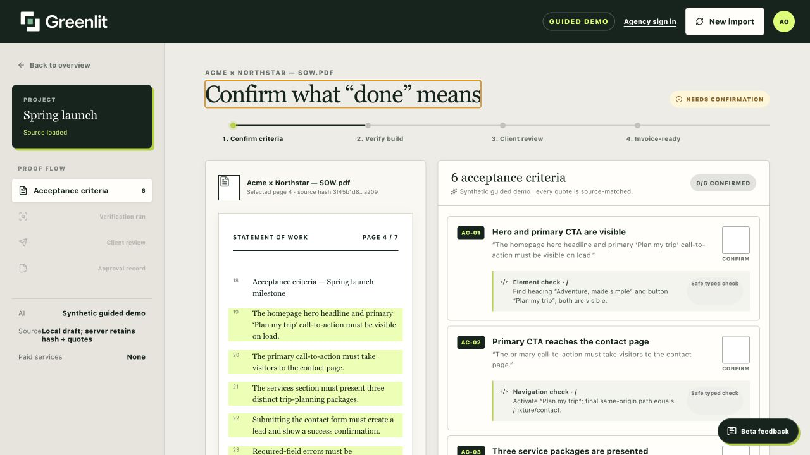
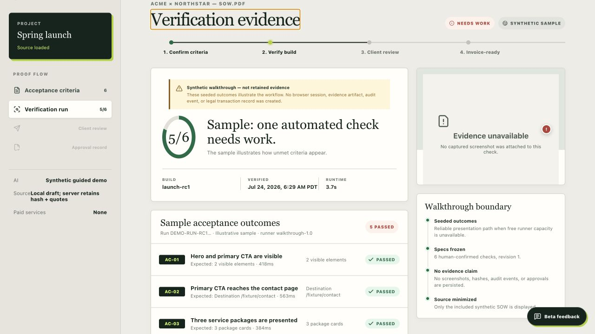
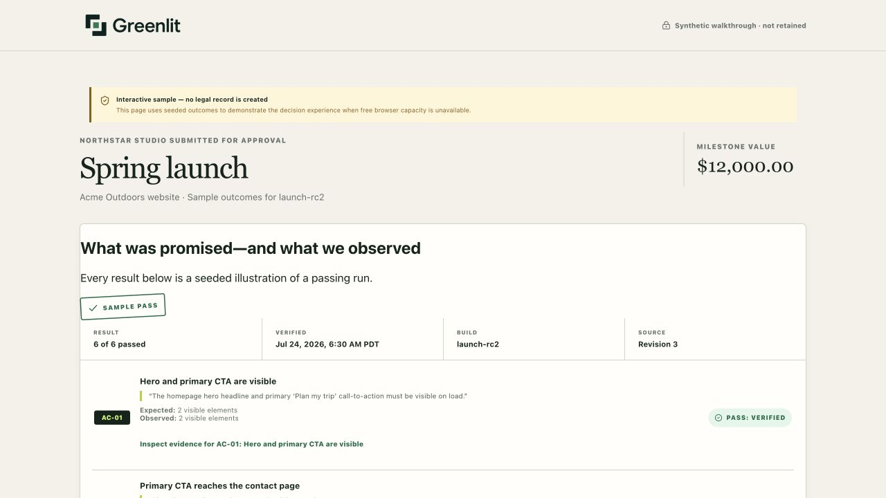
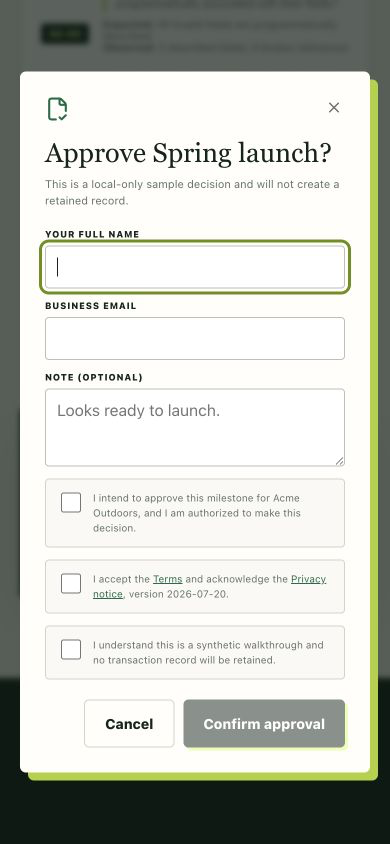
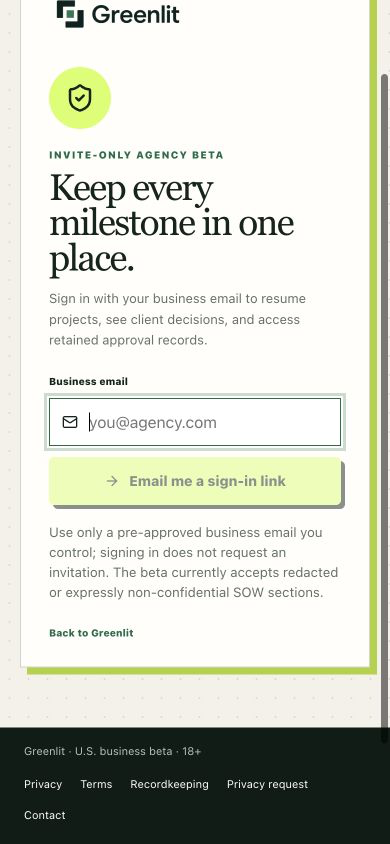
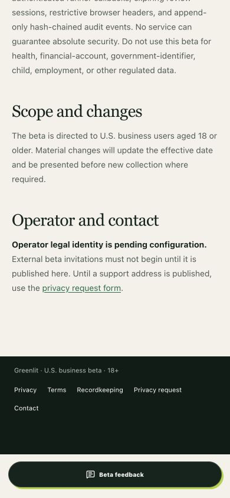

# Greenlit critical beta audit

Date: July 24, 2026

Production: https://greenlitproof.vercel.app

Deployed web commit: `07e255316e82`

Scope: severe issues only; signed-out intake, guided flow, client review, mobile/keyboard behavior, public auth boundaries, launch readiness, and runner isolation.

## Verdict

Greenlit is **not ready for external beta invitations**. This audit confirmed:

1. One new stop-ship runner security defect.
2. One explicit legal/operator deployment blocker.
3. One conditional Gemini blocker for ordinary confidential agency SOWs.

No other P0/P1 issue was confirmed. The public experience, preserved signed-out draft, guided failure/fix flow, sample client decision, mobile layouts, invalid-review handling, expired-link message, and keyboard dialog behavior worked in this audit.

## Tested flow

### 1. Public landing — healthy

The main value proposition, agency sign-in, workspace entry, and guided-demo action were visible and usable on desktop and at 390 × 844.

### 2. Signed-out SOW intake — healthy

The synthetic SOW could be loaded without demo business fields leaking into a new record. The draft survived a reload, and its draft ID was retained in the sign-in return URL. Acceptance criteria remained unavailable before analysis.

### 3. Guided criteria and verification — healthy

The six cited criteria loaded correctly. The first seeded run deliberately failed one check, the fixed-build action reran the walkthrough, and the second result passed all six without claiming retained evidence.

### 4. Client review and decision — healthy

The separate client review displayed source quotes, expected/observed values, and the synthetic trust boundary. Request-changes submission completed locally. The mobile approval dialog fit the viewport, opened with focus in the first field, closed with Escape, and restored focus to the trigger.

### 5. Authentication boundaries — healthy with a test limit

The dashboard redirected signed-out users to sign-in, protected account/admin/Stripe endpoints rejected unauthenticated requests, an invalid review token showed “Review unavailable,” and an invalid authorization code showed the expired-link recovery message.

The current browser profile did not have a live Greenlit magic-link session. Therefore, this audit did not mutate a retained production record, send an email, create a live invoice, or make a real client decision.

### 6. Mobile and keyboard inspection — healthy

The landing page, SOW intake, login, client review, and approval dialog fit at 390 × 844 without horizontal overflow or a feedback-widget collision. The login field had a visible focus ring.

## Confirmed severe findings

### 1. Stop ship: runner origin isolation can be bypassed

The deployed runner installs `page.route("**/*", ...)` after creating the page and closes popups only after the page emits its `popup` event:

- `workers/runner/src/index.ts:256`
- `workers/runner/src/index.ts:260`
- `workers/runner/src/index.ts:265`

The bundled Cloudflare Playwright API documentation explicitly states:

- A page route does not intercept a popup page’s first request: `node_modules/.pnpm/@cloudflare+playwright@1.3.0/node_modules/@cloudflare/playwright/types/types.d.ts:3958`
- The popup event is emitted only after the initial response has begun loading: `.../types.d.ts:1145`
- Browser-context WebSocket routing exists, but the runner does not install it: `.../types.d.ts:9167`

As a result, a malicious or compromised tester-controlled staging page can initiate an off-origin popup request before Greenlit closes it. It can also initiate an off-origin WebSocket because WebSocket traffic is not covered by the HTTP page route. This violates Greenlit’s verified-origin boundary and exposes the Cloudflare browser to unauthorized network egress or SSRF-like probes.

Before real runner access is enabled:

1. Install HTTP routing at the browser-context level before `newPage()`.
2. Reject off-origin WebSockets with `context.routeWebSocket(...)`.
3. Add adversarial tests for popup first requests, redirects, workers, iframes, WebSockets, private IPs, and DNS rebinding.
4. Deploy a new runner version and prove the hostile cases are blocked.

### 2. Stop ship: production legal/operator configuration is incomplete

Production currently returns `readyForBeta: false`. These settings are missing:

- `NEXT_PUBLIC_OPERATOR_NAME`
- `NEXT_PUBLIC_OPERATOR_ADDRESS`
- `NEXT_PUBLIC_GOVERNING_LAW`
- `NEXT_PUBLIC_VENUE`
- `NEXT_PUBLIC_SUPPORT_EMAIL`

The live Privacy Notice and Terms explicitly say external beta invitations must not begin.

### 3. Conditional blocker: Gemini remains on unpaid data terms

Production reports `geminiDataMode.ok: false` with “unpaid tier: confidential SOWs remain blocked.” The live intake correctly requires non-confidential or synthetic material.

This does not prevent a narrowly disclosed non-confidential pilot. It does prevent the ordinary agency-SOW beta Greenlit is intended to run. Paid-tier billing, the applicable provider terms, and `NEXT_PUBLIC_GEMINI_SERVICE_TIER=paid` must be confirmed before accepting confidential scopes.

## Evidence limits

- No active production Greenlit session was available, so retained dashboard/resume, real Gemini output, a real Cloudflare run, a real client token, and Stripe connection/invoice mutation were not repeated.
- Stripe configuration was not publicly observable. It is unverified, not reported as broken.
- Custom SMTP and corporate link-scanner behavior were not tested because that would require sending a real magic link.

## Supporting checks

- Public system health was green for the database, runner version `0.7.1`, backlog, notifications, retention, evidence storage, and daily capacity.
- Latest GitHub release gate for `07e255316e82` passed.
- Repository unit tests, lint, typecheck, desktop/mobile end-to-end tests, and database migration/regression suites passed during this audit.
- No browser console errors appeared in the inspected public flows.
