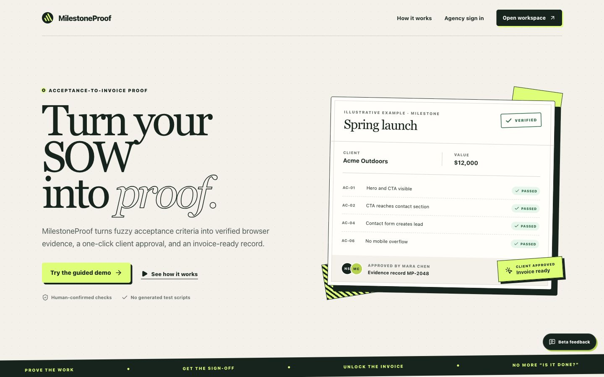
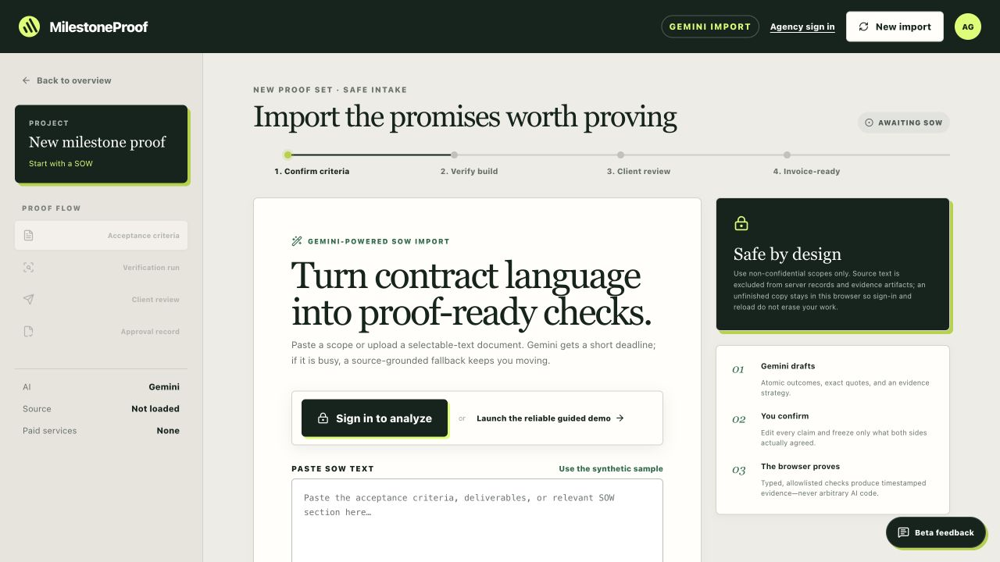

# MilestoneProof fresh beta-readiness audit

Audited: July 21, 2026 
Production: https://milestoneproof.vercel.app 
Verdict: **Not ready for an unsupervised external beta yet.** The public experience and guided demo are substantially polished, but security, privacy, job recovery, legal identity, and production-operations gates remain.

This is a read-only audit. No application code, database state, production configuration, or retained decision was changed.

## Journey health

1. **Public landing page — healthy.** The message, primary demo action, workspace action, and agency sign-in are clear and visually polished.
2. **Signed-out SOW intake — healthy.** A real import starts blank, later phases remain unavailable until criteria exist, and the narrow workspace keeps sign-in and New import reachable.
3. **Criteria confirmation — mostly healthy.** The guided flow exposes exact source quotes and confirmed criteria. Remaining field-error semantics in verification mapping need correction.
4. **Verification setup and execution — not beta-safe yet.** The UI is understandable, but stranded-job recovery, capacity controls, runner versioning, and staging-evidence consent remain incomplete.
5. **Client review — visually healthy, security/legal blocker.** Evidence, observed values, source quotes, and decision actions are clear. The dialog has initial focus, Escape dismissal, and focus restoration. Finalized bearer links can currently be redeemed indefinitely, and the reviewer is not asked to accept the 18+ Terms/Privacy conditions.
6. **Receipt and retained record — mostly healthy.** Exact cents, identifying metadata, hashes, and printable output are present. Long-lived receipt access needs a separate secure design before review links can expire correctly.
7. **Agency dashboard and operator console — functionally improved, not fully rollout-ready.** Remaining narrow-screen header overlap and incomplete job/privacy operations require fixes.
8. **Legal, privacy, and production operations — blocked.** Adult operator identity, monitored email delivery/support, complete privacy fulfillment, backups, quota controls, and a production acceptance transaction are still outstanding.

## P0 — must fix before inviting agencies

1. **Remove the cross-account legacy owner-cookie authorization path.** A signed-in new record still receives `mp_owner`; sign-out does not clear it; run and review APIs authorize by account **or** that cookie. A second account in the same browser can therefore reach or mutate the previous account's record. Make account ownership the only authorization path for signed-in retained records, migrate any legitimate legacy records deliberately, and clear the cookie during sign-out.

2. **Make review links truly expire and revocable.** The redemption route ignores packet expiry after a decision and issues a fresh 72-hour session. The original bearer URL can expose the receipt/evidence for the record lifetime. Expire it permanently and create a separate authenticated or narrowly scoped receipt-access mechanism.

3. **Recover stranded verification jobs safely.** Dispatch errors and worker failure-callback errors can leave jobs `QUEUED`, `LEASED`, or `RUNNING` forever. The operator console can retry only `FAILED` jobs. Add an atomic expire/fail/cancel transition, reconciliation heartbeat, safe retry policy, and queue/DLQ monitoring.

4. **Complete privacy access, export, correction, hold, and deletion for every data subject.** Current fulfillment primarily finds an Auth owner by email. It omits client reviewers, feedback submitters, account notifications, related privacy requests, and parts of review records. The public Privacy promise covers review and approval information, so all of these identities and records must be included.

5. **Repair retention before relying on it.** `privacy_record_amendments.request_id` is `ON DELETE RESTRICT`, while the retention route unconditionally deletes expired privacy requests. One amended request can fail the daily job and stop later cleanup/notification work. Do not purge open requests; add deliberate amendment handling, purge `operator_action_events`, and record a durable successful-maintenance heartbeat.

6. **Publish the real adult operator and legal/contact details.** Set a real authorized adult/entity as operator, a monitored support/privacy contact, mailing address, governing law, and venue. Have an adult/counsel review the final Terms and Privacy notice. Do not invite testers while the site still shows placeholder operator/contact information.

7. **Configure production authentication email.** Supabase's default SMTP is not suitable for an external beta. Configure custom SMTP, a sender domain, SPF/DKIM/DMARC, and test delivery to a non-team agency address. Account for corporate link scanners consuming one-use magic links.

8. **Create and restore-test off-site backups.** Back up Postgres **and** the private evidence bucket, encrypt and restrict the copies, and prove a restoration. A multi-year record promise cannot rely on the free project's default recovery posture.

9. **Inventory and securely remove legacy source data.** Earlier migrations created a source-document bucket/tables; later hardening revoked access but did not prove existing objects/rows were purged. Verify production before claiming original SOWs are not retained.

10. **Verify the production migration ledger.** The latest migrations were reportedly applied through the SQL editor. Confirm their versions are registered in Supabase migration history so a future `db push` cannot re-run, skip, or diverge from production state.

## P1 — fix before the first real cohort

11. **Add reviewer legal acknowledgments.** The decision modal needs explicit 18+ business-use confirmation, Terms and Privacy links, and frozen policy-version identifiers in the retained decision.

12. **Persist the owner's pre-Gemini consent.** Analysis currently receives boolean acknowledgments but does not retain who accepted, when, country/context, and the accepted notice versions. Store a minimized clickwrap record before sending source text to Gemini.

13. **Recheck beta access on every mutation.** Removed testers can still create, extend, or revoke review links through routes that authenticate ownership but do not enforce the current allowlist. Define offboarding behavior and centralize the check.

14. **Use one real runner/deployment version.** The web queues `0.5.0`, while the worker writes `0.4.0` at completion. Store a single build ID or commit SHA and expose it in health checks and receipts.

15. **Fit limits to Cloudflare's free capacity.** The product permits more daily runs/checks than ten free browser minutes and a 60-second browser session can reliably support. Lower initial quotas, cap check count/runtime, prevent a run when capacity is exhausted, and show honest capacity status.

16. **Fit evidence retention to Supabase free storage.** Compress/resize screenshots, monitor bucket usage, and stop cleanly before capacity is exhausted. Current maximum artifact sizes multiplied by runs and 90-day retention can exceed 1 GB.

17. **Disclose and confirm staging evidence capture.** Before running, explain that the public staging site will be screenshotted, shared with the reviewer, and retained for 90 days; require confirmation that it contains no confidential or real personal data.

18. **Add real readiness, monitoring, and alerts.** The runner health route is static. Add checks for queue access, browser launch, callback/database connectivity, deployed versions, job age/backlog, retention heartbeat, notification failures, storage usage, and daily capacity. Assign an adult incident lead and backup.

19. **Run a complete adult-authorized production acceptance transaction.** Invited external login → redacted SOW → Gemini → owned staging origin → real browser run → evidence → separate client browser → adult decision → dashboard → receipt/JSON → privacy export → backup/restore verification.

20. **Make operator retries idempotent and current-lineage only.** A failed job can be retried after a newer job has superseded it, and a form-submission check can be repeated after the external mutation succeeded but evidence/completion failed. Require current `active_job_id`/lineage, classify non-idempotent checks, and require explicit guarded recovery instead of an unconditional retry.

21. **Verify hashes before displaying or deciding a record.** Review, redemption, decision, receipt, and export paths store snapshot hashes but do not recompute them before use. The receipt hash also needs to bind the final audit-chain head. Fail closed on any mismatch and surface a tamper/corruption state.

22. **Disable direct public Supabase email signup.** The website's normal sign-in path is correctly allowlist-gated, but version-controlled Supabase configuration does not prove public email signup is disabled. Turn it off in production and verify the setting through the public Auth API.

23. **Confirm the hosting plan permits this business beta.** Vercel describes Hobby as personal/non-commercial. Have the adult operator confirm the intended agency pilot is permitted under the current entitlement or move to hosting whose terms allow it; this is a contractual gate, not a code bug.

24. **Plan for Supabase Free pausing and recovery.** Verify the daily maintenance job creates real activity, monitor pause-warning mail, name the adult who can resume the project, and document what testers see while the database is paused.

25. **Complete a production-configuration sign-off without exposing secrets.** Verify all migrations and Auth settings, Site URL/callback, intended adult allowlist/admin list, separate record-hash secret, matching web/runner HMAC secrets, Gemini's unpaid label, queue backlog, retention's latest `200`, and matching deployed versions. If a notification webhook is enabled, name that provider and disclosed reviewer metadata in Privacy.

## P2 — product and accessibility cleanup for a professional pilot

26. **Fix narrow headers.** Dashboard/operator headers can overlap at 320 px or high zoom. The public header's wrap breakpoint also leaves a risk around common 393–412 px widths. Test 320, 375, 390, 393, 412, and 200% zoom.

27. **Attach each mapping error to the field that failed.** Several element-reference, expected-value, count, form, success, mutation, build, and origin errors currently mark only the page-path field or remain global. Give each input its own `aria-invalid` and `aria-describedby` relationship.

28. **Provide full-resolution evidence inspection.** Captured screenshots are capped inside a small image area. Add open/zoom/download controls with criterion-specific accessible names and keep hashes next to the corresponding artifact.

29. **Correct overlay stacking.** Toasts currently sit above the feedback modal/widget layer. A notification can visually interfere with the dialog; define a single overlay stack and verify focus/visibility.

30. **Finish contrast cleanup.** Receipt footer/ID text, mapping help, and a few criterion labels are still around or below the 4.5:1 target for normal text. Verify default, hover, focus, disabled, print, and forced-colors states.

31. **Increase remaining touch targets.** Some small buttons, header controls, evidence summaries, operator selects, and dashboard text links remain below roughly 44×44 px.

32. **Strengthen citation/evidence semantics.** Programmatically associate each cited source passage with its exact criterion, and give repeated evidence disclosures names such as `Inspect evidence for AC-03` rather than six identical names.

33. **Add Contact to the visible footer.** `/contact` exists but has no normal footer path.

34. **Add a release gate and deployment manifest.** Run typecheck, lint, unit tests, build, migration verification, and E2E smoke in CI; expose web/runner/database versions in a deployment endpoint; update stale implementation-status documentation.

35. **Add privacy-safe pilot telemetry and an invite ledger.** Measure delivery/sign-in, analysis mode, origin verification, queue/run latency, failure reason, review redemption, and decision completion without collecting SOW text, client names, URLs, notes, or evidence. Track who was invited, adult sponsor, status, removal, and Auth cleanup.

36. **Preserve every accepted upload through sign-in.** The UI accepts 3 MB files, but browser draft persistence stops at 1.5 MB and asynchronous conversion can still be in flight when sign-in begins. Align the limits, await persistence, warn when a file cannot be preserved, and extend/communicate the current 30-minute draft handoff expiry.

37. **Merge local source text when resuming a retained project.** Server snapshots intentionally omit source text and currently rebuild context from criterion quotes, even when the same browser still holds the complete local source. Merge the account/project-scoped local draft so change requests can cite uncited passages.

38. **Validate business-field maximum lengths before Gemini.** Required/non-empty validation exists, but agency/client/project/milestone maximums are enforced only when starting a run. Reject over-limit fields before consuming AI quota.

39. **Make notification retries claim-based and preserve history.** Retry currently resets attempt/error history, while delivery uses a read/increment/update pattern that can duplicate sends under concurrency. Claim each outbox row atomically and append attempt history.

40. **Represent legal holds as separate matters.** A single bulk boolean lets one privacy request release another matter's hold. Store hold ID, scope, reason, owner, dates, review schedule, and independent release authority.

41. **Surface and audit deletion failures.** Persistent record-purge failures are not shown in the operator overview or appended as operator/audit events. Add a failed-deletion queue, owner, retry state, and alert.

42. **Reject duplicate criteria/check manifests before queuing.** Enforce unique criterion IDs, check IDs, and one intended mapping per criterion so a malformed request cannot create an uncompletable job and consume browser quota.

43. **Drop or revoke legacy service-role RPCs.** Older decision and direct-purge functions remain callable and can bypass the replacement notification or staged-retention workflows. Remove them after verifying no deployed path depends on them.

44. **Finish real-site runner waits and document the resource policy.** Count and viewport checks can run before hydration/layout settles. The runner also blocks every cross-origin resource, so CDN-hosted assets/fonts can make legitimate staging pages render incorrectly. Add bounded readiness/layout waits and either safely allow passive verified resources or explicitly require self-contained same-origin staging.

45. **Make active review-link recovery explicit.** After reload, recreating a still-active review packet fails even though the UI implies a fresh link can be minted. Restore the existing link securely, or lead the user through revoke-and-create with a clear warning.

46. **Preserve operational retention history completely.** Purge expired `operator_action_events`, keep a durable maintenance log, and ensure cleanup continues per-item when one record fails.

47. **Make review/evidence controls uniquely named.** Repeated evidence disclosures currently share the same accessible name; include the criterion ID/title so screen-reader users know which evidence will open.

## Evidence from this run

The screenshots show the current public build, not mockups. Browser DOM inspection also verified the synthetic review's exact quotes/results, initial decision-dialog focus, Escape dismissal, and focus restoration.

## Testing limits

- No new Gemini payload, retained verification job, notification, review approval, or privacy request was submitted.
- No adult-only decision was made.
- The already signed-in Chrome session became unavailable to browser automation, so dashboard/admin mobile visuals were corroborated from current source rather than recaptured.
- A temporary responsive viewport override did not apply reliably in the in-app browser; the saved 320 px workspace capture is valid, while the 393–412 px public-header item is source-backed and should be confirmed in a dedicated device run.
- Browser inspection does not replace legal advice, penetration testing, or a third-party accessibility conformance audit.
